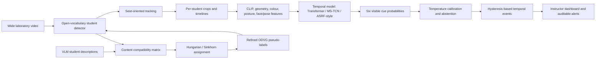

# Deep Learning-Based Real-Time Student Behavior Analysis and Attention Loss Detection

## A near-real-time, leak-free, uncertainty-aware visible-cue study in a computer-laboratory setting

**Master's Thesis — First Draft**

**Author:** [AUTHOR NAME]

**Student number:** [STUDENT NUMBER]

**Programme:** [PROGRAMME NAME]

**Department / University:** [DEPARTMENT AND UNIVERSITY]

**Supervisor:** [SUPERVISOR NAME]

**Submission date:** [MONTH YEAR]

> **Draft status and evidence rule.** This draft retains the registered project title; the subtitle and thesis text qualify the demonstrated system as near-real-time and operationalise “attention loss” as sustained visible cues. It was assembled from the repository at commit `03e73f2b5c3f83d7544439a8d9ff71cd8115987d`. Results in `FINDINGS.md` Section 11 and `outputs/THESIS_DRAFT_RESULTS.md` supersede earlier exploratory results. Values explicitly marked non-citable in `outputs/FINAL_RESULTS_REGISTER.*`, the March 2026 experiments, the contaminated 0.9231 matching result, and DDP shard-local macro-F1 values are excluded. Most raw HPC checkpoints and prediction archives are not present in this clone; before submission, replace repository evidence notes with permanent artifact identifiers from the recovered thesis bundle.

---

## Abstract

Automated analysis of classroom video is often described as attention or engagement recognition, although internal cognitive states cannot be observed directly from pixels. This thesis adopts a narrower operational target: the detection, attribution, and temporal aggregation of observable student behavioural cues in a computer laboratory. The system reports cues such as screen orientation, looking away, head-down posture, turning towards a peer, and phone-use evidence; it does not claim to measure attention, comprehension, boredom, or curiosity.

The work addresses two linked technical problems. First, descriptions generated for multiple students in one frame must be assigned to the correct student boxes before they can supervise an open-vocabulary detector. A controlled ablation compares detector-confidence-order assignment with content-based Hungarian assignment while holding images, boxes, captions, training schedule, learning rate, seed, and evaluation data fixed. Hungarian assignment raises validation Recall@1 from 0.3230 to 0.4954, an absolute gain of 0.1724 (53% relative), while Recall@10 changes by only 0.0141. This divergence indicates that the gain is principally one of attribution rather than person localisation. A model trained with exact correspondences reaches test Recall@1/5/10 of 0.6462/0.9891/0.9982 on a pre-registered, untouched 27-video test split.

Second, per-student cue sequences are modelled using a generic temporal transformer, a multi-stage temporal convolutional network (MS-TCN), and an Action Segment Refinement Framework (ASRF)-style model. All models use a shared 73/27/27 video-wise partition, three training seeds, one evaluator, and paired video-level cluster bootstrap comparisons. With the same 556-dimensional features, MS-TCN improves test macro-F1 over the transformer by 0.0933 in all three seed pairs and reaches 0.500 ± 0.011. ASRF reaches 0.477 ± 0.016 under the pre-registered primary configuration. An isolated feature ablation shows that head pose contributes approximately 0.0296 test macro-F1, whereas facial-expression and body-language/gaze-dynamic blocks do not provide a repeatable aggregate gain. Approximately four fifths of the useful head-pose effect comes from whether a face is detectable, rather than from yaw, pitch, and roll.

Human-referenced evaluation uses 754 accepted dense annotations from two selected segments, yielding 16 distinct episodes over ten tracks after removing a duplicated event channel. MS-TCN reduces over-segmentation, raising edit score to 59.9 from 28.8–38.2 for transformer configurations, but event recall remains low at a maximum of 0.312 compared with 0.625 for the pseudo-labelling teacher. These values are diagnostic rather than population estimates. Temperature calibration and validation-frozen abstention thresholds suppress uncertain alerts. The adopted deployment pipeline replaces a facial landmark mesh with a face detector and strides object detection and temporal inference, reaching 5.77 FPS at approximately six visible students on one A100 with 94.7% frame-cue agreement relative to the unstrided pipeline. Because it does not meet a 10 FPS budget and retains a long latency tail, the system is described as near-real-time.

External evidence further limits the claim. On DIPSER, an a-priori head-movement proxy correlates weakly but significantly in the opposite direction to the naive disengagement hypothesis (Spearman rho = +0.172, permutation p < 0.0001). A basic-expression model reaches only 0.544 AUROC for expert-labelled boredom. The results demonstrate that visible cues are setting-dependent and should support, not replace, instructor judgement. The contribution is therefore a leak-free, human-audited and uncertainty-aware pipeline for observable cue analysis, together with controlled evidence about pseudo-label attribution, temporal architecture, deployment trade-offs, and the failure modes of plausible but invalid evaluation.

**Keywords:** student behaviour analysis; visible attention cues; open-vocabulary detection; visual grounding; pseudo-labels; temporal action segmentation; MS-TCN; ASRF; calibration; selective prediction; classroom video.

---

## Acknowledgements

[ACKNOWLEDGE SUPERVISOR, LAB, DATA CONTRIBUTORS, ANNOTATORS, AND HPC SUPPORT. Do not name participants or disclose identifying information.]

## Declaration and ethics statement

[INSERT THE UNIVERSITY'S REQUIRED AUTHORSHIP DECLARATION.]

[INSERT THE VERIFIED ETHICS/CONSENT BASIS, APPROVAL OR EXEMPTION NUMBER, DATA-RETENTION POLICY, AND PUBLICATION PERMISSION. No such record was found in the repository, so this text must not be completed by inference.]

## Abbreviations

| Abbreviation | Meaning |
|---|---|
| AP / mAP | average precision / mean average precision |
| ASRF | Action Segment Refinement Framework |
| AUPRC | area under the precision–recall curve |
| AUROC | area under the receiver-operating-characteristic curve |
| CLIP | Contrastive Language–Image Pre-training |
| CMOSE | Comprehensive Multi-Modality Online Student Engagement dataset |
| DDP | distributed data parallel training |
| DIPSER | Dataset for In-Person Student Engagement Recognition in the Wild |
| ECE | expected calibration error |
| FER | facial-expression recognition |
| FPS | frames per second |
| IoU / tIoU | spatial / temporal intersection over union |
| LLM | large language model |
| LLMSTU | internal student-crop corpus used by this project |
| MS-TCN | Multi-Stage Temporal Convolutional Network |
| NLL | negative log likelihood |
| ODVG | open-domain visual grounding data format |
| OVD | open-vocabulary detection |
| QWK | quadratic weighted kappa |
| R@k | Recall at rank k |
| SCB | Student Classroom Behaviour dataset |
| VLM | vision–language model |

---

# 1. Introduction

## 1.1 Motivation

Classroom cameras make it technically possible to analyse multiple students over time, but the educational interpretation of video remains difficult. A camera observes posture, orientation, visible objects, and motion. It does not directly observe attention, comprehension, motivation, curiosity, or learning. A student may look down to use a phone, write notes, read instructions, or operate a keyboard; the same pixels can have different meanings under different tasks and room layouts. Systems that collapse these possibilities into a universal “attention score” risk producing confident but ungrounded judgements.

This thesis investigates a narrower and more auditable problem in a university computer laboratory. Each student is localised and tracked, observable cues are classified over time, and sustained cue runs are converted into events suitable for an instructor dashboard. The system may report “Seat 5: head down for 31 seconds” or withhold an alert when confidence is low. It does not report “Seat 5 is inattentive.” The intended role is decision support: surface verifiable evidence to a human instructor, who retains the task context and authority to interpret it.

The setting creates two technical challenges. First, the wide frame contains several students. A VLM may describe “Student 1” and “Student 2,” while a detector returns boxes in confidence order. Those orderings have no inherent relationship. Incorrect description-to-box binding silently corrupts the supervision used to fine-tune a grounding detector. Second, classroom cues are temporal. A short glance is not equivalent to a sustained look away, and isolated frame accuracy does not measure whether event boundaries are stable enough for alerts. The project therefore separates description-to-student grounding, framewise cue classification, event localisation, and deployment performance rather than compressing them into one score.

## 1.2 Problem statement

The research problem is to design and evaluate a near-real-time video pipeline that:

1. identifies students in a wide computer-laboratory view;
2. attributes generated student descriptions to the correct person boxes;
3. produces per-student timelines of six observable cue classes;
4. converts sustained off-task cues into events with calibrated alert suppression; and
5. reports empirical limits arising from pseudo-labels, context dependence, occlusion, small faces, human annotation, and runtime scaling.

The operational classes are `screen_oriented`, `looking_away`, `head_down`, `turned_to_peer`, `phone_use`, and `uncertain`. “Attention loss” in the original project title is therefore operationalised only as a sustained, visible off-task cue in this specific computer-lab setting. It is not treated as a latent psychological state.

## 1.3 Research questions

The thesis addresses five research questions.

**RQ1 — Attribution.** How much does caption-unit-to-box binding quality affect phrase-to-student grounding when all other training conditions are held fixed?

**RQ2 — Temporal modelling and features.** For six-class visible-cue classification, do temporal architectures designed for piecewise-constant segments provide more value than adding head-pose, facial-expression, and motion/gaze feature blocks to a generic transformer?

**RQ3 — Events.** To what extent do frame-level gains translate into human-referenced temporal-event recall, boundary quality, segmental edit score, and false alerts per hour?

**RQ4 — Deployment.** Can the pipeline produce calibrated, uncertainty-aware outputs at near-real-time speed, and what accuracy/latency trade-offs arise from simplifying face analysis and striding expensive stages?

**RQ5 — Validity across settings.** Do external datasets support a universal mapping from the selected visible cues to engagement or academic emotion?

## 1.4 Objectives

The objectives are:

- recover recording identity and construct a leak-free video-wise split;
- audit pseudo-label quality against human annotation;
- replace ordinal description-to-box binding with an explicit bipartite assignment method;
- fine-tune and evaluate an open-vocabulary grounding model;
- compare a transformer with MS-TCN and an ASRF-style boundary model under controlled conditions;
- isolate the contribution of each named feature family;
- evaluate temporal segments and events against a human-annotated diagnostic set;
- calibrate predictive confidence and define an abstaining alert policy;
- profile the complete deployment pipeline across student counts; and
- document negative results and invalidated experiments rather than selecting only favourable findings.

## 1.5 Contributions

This thesis makes four primary contributions.

1. **Leak-free data and evaluation construction.** Video identity is recovered for 128 appearance chains and checked on 4,660 anchors. A video-wise 73/27/27 split prevents neighbouring frames from crossing partitions, and both grounding and temporal branches use the same split.
2. **Controlled pseudo-label attribution study.** Content-based Hungarian assignment raises grounding R@1 by 0.1724 over confidence-order assignment while R@10 remains similar. The study also shows that aggressive confidence filtering reduces downstream R@1.
3. **Controlled temporal modelling study.** Three-seed, paired comparisons show that MS-TCN/ASRF-style temporal inductive biases improve macro-F1 by approximately 0.10 on validation and 0.07–0.09 on test over the generic transformer, whereas most added feature blocks do not provide repeatable aggregate gains.
4. **Uncertainty-aware near-real-time prototype.** The complete pipeline includes student tracking, per-seat timelines, event hysteresis, temperature calibration, abstention, a privacy-oriented dashboard, and measured optimisations reaching 5.77 FPS at about six students with 94.7% cue agreement to the unstrided reference.

Two supporting contributions are the human-referenced event evaluation and the audit of silent experimental failures. These establish how much of the pipeline's apparent performance survives corrected measurement.

## 1.6 Scope and non-claims

The work is limited to one computer-laboratory corpus, one camera style, and a six-cue nominal taxonomy. It does not estimate learning outcomes, diagnose students, identify individuals, or provide a general classroom engagement score. Facial expressions and gaze dynamics are implemented and experimentally measured, but no boredom, perplexity, curiosity, or fine-grained gaze claim is made. External datasets are used either for contextual evidence or separate within-dataset tasks; incompatible metrics are never merged into one leaderboard.

## 1.7 Thesis structure

Chapter 2 reviews open-vocabulary grounding, temporal segmentation, engagement datasets, calibration, and the distinction between visible behaviour and internal engagement. Chapter 3 describes the corpus, annotation, taxonomy, and split construction. Chapter 4 presents the two system branches, temporal models, event logic, evaluation protocol, and deployment design. Chapter 5 reports the results. Chapter 6 interprets the findings and answers the research questions. Chapter 7 addresses ethics, limitations, and threats to validity. Chapter 8 concludes and proposes future work.

---

# 2. Background and Related Work

## 2.1 Observable cues versus engagement constructs

Student-engagement research does not define one uniform computer-vision task. DAiSEE assigns four levels to boredom, confusion, engagement, and frustration in single-user video snippets [11]. EngageWild models four engagement levels and temporal localisation in e-learning video [12]. CMOSE provides ordered engagement labels and multimodal features for online-learning segments [8]. EngageNet combines learned representations with action units, gaze, and head pose [14]. Classroom-oriented work by Sümer et al. uses attentional and affective facial features and reports different performance across grade groups, including gains from limited person-specific calibration [13]. The Student Engagement Dataset focuses on engaged versus wandering attention during webcam-based mathematical problem solving [15].

These tasks differ in label semantics, camera geometry, split unit, and metric. A four-level engagement accuracy, continuous-regression mean squared error, behaviour-detection mAP, visible-cue macro-F1, grounding R@1, and temporal-event recall answer different questions. This thesis therefore treats literature values as contextual references, not a cross-dataset leaderboard.

The distinction is also epistemic. Engagement labels often integrate observer judgement, self-report, task context, and behavioural evidence. This project has only wide-shot pixels and limited task metadata. It consequently targets observations that another person can verify from the same image. Interpretation is deferred to the event layer and, ultimately, the instructor.

## 2.2 Open-vocabulary detection and visual grounding

Closed-set object detectors predict from a fixed label vocabulary. Open-vocabulary detectors incorporate language so that categories or referring expressions can be supplied at inference time. Grounding DINO combines a DINO-style detector with grounded pre-training and cross-modal fusion for open-set detection and referring-expression grounding [3]. LLMDet extends open-vocabulary detection with detailed image captions and LLM supervision [4]. The present project starts from the LLMDet/Grounding-DINO Swin-T codebase and adapts it to multi-student computer-laboratory data.

The relevant output is not simply “person detected.” Each behavioural phrase must retrieve the correct student box among the candidates in the same frame. R@1, R@5, and R@10 are therefore used for phrase-to-region grounding. These metrics must not be equated with SCB's behaviour-box mAP: R@k ranks candidate regions for a phrase, whereas mAP evaluates scored detections over classes and IoU thresholds.

## 2.3 Pseudo-labels and description-to-box assignment

Large VLMs can provide scalable descriptions when manual per-student annotation is costly, but the description must be bound to the correct visual instance. The historic pipeline mapped “Student N” to the Nth detector output. Detector-confidence order is unrelated to a captioner's enumeration, so a missed person can shift every subsequent label.

This thesis formulates binding as a one-to-one assignment between student description units and candidate boxes. CLIP provides content representations learned through contrastive image–text supervision [2]. A compatibility matrix is constructed from content similarity, and the Hungarian algorithm selects a minimum-cost bipartite assignment. Sinkhorn/optimal-transport assignment is evaluated as an offline alternative. Assignment confidence is calibrated on held-out videos rather than chosen from an unvalidated heuristic.

## 2.4 Temporal cue modelling

Transformers model sequences with self-attention [1] and are widely used as generic temporal encoders. Classroom cue sequences, however, are piecewise constant: a student often remains screen-oriented or head-down for a sustained interval. Temporal action-segmentation models embed this assumption more directly.

MS-TCN uses multiple stages of dilated temporal convolutions. Later stages refine the previous stage's class probabilities, and a smoothing loss suppresses over-segmentation [5]. ASRF separates action classification from boundary regression so predicted boundaries can refine framewise labels [6]. These architectures motivate two hypotheses tested here: first, a temporal-convolutional inductive bias will outperform a generic transformer on the same features; second, explicit boundary modelling will improve segmental edit score and event localisation even when frame accuracy is similar.

The project implements an MS-TCN baseline and an ASRF-style model with a shared dilated-TCN encoder, class-refinement stages, a boundary head, and boundary-driven segment relabelling. It is an adaptation to the project taxonomy, not a claim of exact reproduction of every hyperparameter in the original repositories.

## 2.5 Head pose, gaze, body motion, and facial expression

Wide classroom images make fine-grained facial analysis difficult. Occlusion varies substantially across recordings, and each student occupies a small fraction of the full frame. The project therefore combines a high-level CLIP representation with coarse geometry, colour, posture, face detectability, pose angles, expression probabilities, and temporal motion/gaze features.

Head pose and gaze are plausible orientation signals, but estimator coverage can itself be label-correlated. This project finds that whether the face backend succeeds is more useful than its metric angles. Facial-expression recognition raises a different construct-validity problem: a recogniser trained for basic expressions such as happiness, sadness, anger, fear, surprise, and neutral does not automatically measure academic emotions such as boredom, confusion, or curiosity. The DIPSER boredom experiment explicitly tests and rejects that shortcut.

## 2.6 Calibration, abstention, and human-in-the-loop alerting

Modern neural networks can be miscalibrated: confidence does not necessarily equal empirical correctness. Temperature scaling fits one scalar on validation logits and often improves calibration without changing the predicted class [7]. For a classroom interface, calibration supports selective prediction. Low-confidence frames can be displayed as `uncertain`, and a stricter threshold can prevent alerts from firing. This is preferable to forcing every frame into an interpretation and is aligned with a human-in-the-loop role.

## 2.7 External datasets and comparability

CMOSE contains multimodal online-learning segments with four ordered engagement levels [8]. DIPSER contains in-person, multi-camera student data with attention and academic-emotion annotations from self-report and experts [9]. SCB provides classroom behaviour boxes over multiple classes [10]. DAiSEE [11], EngageWild [12], classroom facial-video work [13], EngageNet [14], and the Student Engagement Dataset [15] provide related but non-equivalent targets.

This thesis uses external data in three restricted ways. DIPSER tests context dependence and the relationship between basic expressions and expert boredom. CMOSE supports a separate ordinal-engagement experiment and a split-policy analysis. SCB provides a qualitative domain-shift probe whose precision and R@k are confounded because ordinary students are not exhaustively annotated in the selected subset. None of these results is used as a direct numerical competitor to LLMSTU cue macro-F1.

## 2.8 Research gap

Many engagement studies evaluate short clips or one face at a time. The present setting requires assigning descriptions among multiple students, maintaining per-seat timelines, evaluating sustained episodes, and controlling false alerts. The research gap addressed here is therefore not a new universal engagement classifier. It is the combination of reliable description-to-person attribution, leak-free multi-student temporal evaluation, and uncertainty-aware event delivery, together with empirical tests of the assumptions that connect those stages.

---

# 3. Dataset, Taxonomy, and Annotation

## 3.1 Internal computer-laboratory corpus

The internal LLMSTU corpus was sampled at 1 FPS from 128 university computer-laboratory recordings. It contains 283,913 per-student records and corresponding 512 × 512 letterboxed crops. Each record includes a natural-language caption, model confidence, two box definitions, keypoint counts, visibility fields, and structured fields for activity, attention target, gaze direction, posture, hand state, talking, phone visibility, laptop visibility, occlusion, and an engagement-level field. The structured annotations were produced by a Qwen3-VL-family VLM. The exact point release is not stored in the records and is treated as a reproducibility limitation; references in earlier files to Qwen3-VL and Qwen3.5-VL cannot be resolved from repository evidence.

One recovered recording contains 1,358 frames but no LLMSTU pseudo-label records. It is excluded upstream of all splits, leaving 127 videos used by the detector and temporal experiments.

The wide scene is substantially harder than a webcam-style engagement dataset. The original frames are approximately 2812 × 1050 and show several seated students, monitors, partial occlusion, and small faces. The stored crop is a tighter subregion than the person detector box: the repository audit measured median IoU 0.706 between `bbox_crop` and `bbox_person`, with horizontal trimming varying enough that the crop cannot be reconstructed reliably at runtime. This distinction matters because frame-relative geometry becomes constant if computed from an already cropped image.

## 3.2 Video-identity recovery

Only 2.3% of crop filenames directly exposed a video identity, preventing a video-wise split. Identity was recovered through appearance-chain tracking. Low-resolution thumbnails were associated within frame-index groups using Hungarian matching, yielding 128 appearance chains. All 4,660 available anchors agreed with the recovered video identity.

This recovery enables the split unit to match the strongest correlation in the data: the source recording. A frame-wise split would distribute nearly identical observations of the same student, seat, room, and lighting across training and evaluation.

## 3.3 Deduplication, completeness, and occlusion

Sampling at 1 FPS creates long runs of near-identical student crops. Run-length encoding of structured label tuples followed by subsampling reduces 283,913 records to 84,950 crop selections. A further 13,239 visually unusable records meet the rule `occluded AND face_kpts == 2`. Per-video occlusion ranges from 16.5% to 61.5%.

Deduplication is used differently by the two branches. For detector training, it selects source frames and prevents repeated images from dominating the data. Once a frame is retained, all students in that frame are restored from the dense tracked records: 36,339 training frames contain 141,522 annotated students. This avoids treating visible but omitted students as background. For the temporal model, the dense 1 FPS records are retained because deduplication would destroy the regular sampling and shorten episodes. An early head-pose sequence build accidentally used deduplicated records, producing a median 4.3-second gap and 40% fewer sequences; it was rejected before training.

The annotation-completeness audit verifies that all 141,522 ODVG boxes with non-negative seat IDs exist in the tracked data and that 99.73% correspond to the original raw shards. The remaining 0.27% are seat-noise records with negative IDs. This proves that the conversion pipeline does not discard students after detection. It does not prove that the upstream detector found every visible student, because no exhaustive human person-box ground truth exists. Comparison with an independent older detector shows roughly symmetric disagreement and cannot resolve recall.

## 3.4 Visible-cue taxonomy

The final Branch-B taxonomy contains six nominal classes. Mapping is deterministic from the structured fields and applies a fixed precedence so that a specific cue overrides a generic on-task field.

| ID | Cue | Operational evidence |
|---:|---|---|
| 0 | `screen_oriented` | laptop use, listening, reading, writing notes, or task-oriented gaze/target |
| 1 | `looking_away` | gaze away/window, looking-away activity, or distracted target |
| 2 | `head_down` | head-down/sleeping activity or head-down/slumped posture |
| 3 | `turned_to_peer` | talking-to-peer activity, talking flag, or peer gaze/target |
| 4 | `phone_use` | phone-use activity, visible phone, gaze to phone, or hand on phone |
| 5 | `uncertain` | severe occlusion/unverifiable fields or the residual former `idle_other` class |

`uncertain` is evaluated as a class rather than selectively removed after seeing results. The taxonomy intentionally labels `head_down`, not “sleeping,” because the structured source mixes sleeping, resting, writing, and downward posture. Likewise, `phone_use` is a cue based on visible object and related structured evidence, not proof of off-task intent.

The original seven-class design included `idle_other`. Only 16 of 283,913 records reached that fallback after precedence rules, causing an extreme inverse-frequency weight. It was merged into `uncertain`, and legacy seven-class arrays are remapped at load time. The event channel `inactivity` was later removed because it was an exact alias of `head_down`; a genuine inactivity event would require a distinct motion-based definition.

## 3.5 Human annotation

Two human-audit sets were constructed.

### 3.5.1 Scattered frame sample

A stratified sample of 1,000 crops was prepared with pseudo-labels pre-filled for editing. One annotator accepted 445 and rejected 555 as visually unverifiable. The accepted records were partitioned video-wise into 134 calibration and 311 held-out audit samples. Across the held-out sample, the structured pseudo-label fields reach 93.9% accuracy; activity is the weakest field at 78.9%. The derived six-class cue agrees with the annotator on 85.9% of accepted frames.

The high rejection rate is itself evidence about the camera geometry. It argues against treating fine facial affect or gaze as the primary signal and supports an explicit uncertainty class.

### 3.5.2 Dense event sample

Dense annotation covers 984 consecutive per-student crops from two selected three-minute segments: one chosen to contain head-down behaviour and one chosen to contain phone-related behaviour. The preserved raw bundle verifies 754 accepted and 230 rejected annotations. The accepted frames span ten tracks in the final evaluator.

The pseudo-labelling teacher agrees with the accepted human cue on 87.4% of frames, close to the scattered sample's 85.9%. Recall is high for `head_down`, `looking_away`, and `screen_oriented`, but lower for `phone_use` and `turned_to_peer`. The main phone disagreement reflects a semantic boundary: the human annotator sometimes inferred phone use from gaze and temporal context when the device was behind a monitor, whereas the VLM required visible phone evidence. These sources answer slightly different questions, so teacher agreement is an empirical benchmark, not a theoretical ceiling or a direct estimate of error.

The original derived file reported 24 events. Seven `inactivity` events duplicated seven `head_down` events exactly, and one zero-length `return_to_task` marker was repeated. After removing these artefacts, the human diagnostic set contains **16 distinct episodes**: seven head-down, five phone-use, two peer-interaction, and two distinct return-to-task events. One episode therefore changes aggregate recall by 6.25 percentage points.

All human annotations in the repository use one annotator identity. No second-annotator agreement result is available. Accordingly, this thesis refers to a *human-annotated diagnostic set* rather than an unquestionable ground truth.

## 3.6 Train, validation, and test partition

All final experiments use a video-wise 73/27/27 split.

| Split | Videos | Detector frames | Temporal sequences | Temporal frames |
|---|---:|---:|---:|---:|
| Train | 73 | 36,339 | 4,390 | 185,050 |
| Validation | 27 | 9,352 | 1,085 | 42,702 |
| Test | 27 | 9,405 | 1,056 | 43,733 |

The split contains zero video overlap. The temporal arrays originally used an independent 102/25 train/validation split, placing 23 detector-test videos in temporal training. Because every sequence stores `video_id`, the arrays were re-partitioned by metadata without re-extracting features, and all final temporal models were retrained from scratch.

The Branch-A test split was read once after a protocol was committed. Branch B similarly recorded architecture, feature set, checkpoint selection, calibration, and alert-threshold rules before test evaluation. The pre-registered Branch-B primary model was ASRF with 556 features. MS-TCN later scored higher on test; the selection was reported as made rather than revised. The written Branch-B protocol names five test configurations; several extra rows in the final test table were produced by whole-root evaluation but were not listed in that exact set. Those extra rows are marked exploratory in this draft.

## 3.7 External data

Three external resources contribute evidence without being merged into the internal task.

- **DIPSER:** 25 usable subjects and 1,825 expert-rating pairs support the cue–engagement context analysis. A subset of 1,176 pairs supports basic-expression-to-boredom evaluation on held-out subjects.
- **CMOSE:** a separate four-level ordinal model uses released I3D embeddings. Of 12,197 clips encountered by the pipeline, 11,902 have non-empty embeddings. Results are produced under both the official random-segment split and a subject-disjoint re-split.
- **SCB:** 505 validation images with 3,753 annotated regions are converted for a frozen zero-shot probe. Because the selected SCB subset does not exhaustively annotate ordinary students and its bow/turn semantics differ from the computer lab, the result is treated as qualitative domain-shift evidence.

DAiSEE, EngageWild, EngageNet, and related classroom datasets are included in the literature comparison but are not trained in this project because they would introduce different tasks without resolving the core event-evaluation question.

## 3.8 Privacy and data governance

The implemented interface uses seat identifiers rather than names or demographic attributes. Caption neutralisation removes protected-attribute terms from training text. The dashboard can blur face regions and serves downscaled frames. Raw predictions are retained when display/alert abstention suppresses an output, supporting later audit.

These technical measures do not establish legal or ethical authority to collect and process the video. No ethics approval, consent documentation, data-retention plan, or publication permission is present in this repository. The final thesis must insert the verified institutional basis and approval/exemption details. Until then, ethics status is an unresolved submission dependency, not a completed contribution.

---

# 4. Methodology

## 4.1 System overview

The implemented system contains two complementary branches. Branch A constructs reliable description-to-student supervision and fine-tunes the grounding detector. Branch B operates on per-student feature sequences, classifies visible cues, forms sustained events, calibrates confidence, and delivers selective dashboard outputs.



**Figure 4.1.** Corrected implemented architecture. The detector is the fine-tuned LLMDet/Grounding-DINO branch, the final taxonomy has six cues, and the final human set has one annotator. The proposal-era `overall system.png` is retained in Appendix D only because it contains components that were not implemented or not verified as drawn.

## 4.2 Branch A: description-to-student grounding

### 4.2.1 Student-unit representation

A whole-frame VLM response is parsed into student description units. Each unit groups the cues describing one student so that its phrases cannot be distributed across several boxes. Training annotations are stored in ODVG form with validated character spans. The older whole-frame pipeline mixed global captions and tags into every region and is excluded from final results.

### 4.2.2 Binding baselines and assignment

Let descriptions in a frame be \(U = \{u_1, \ldots, u_m\}\) and candidate student boxes be \(B = \{b_1, \ldots, b_n\}\). The historic ordinal baseline assigns \(u_i\) to the detector's \(i\)-th confidence-ranked box. The proposed offline refinement computes a content cost matrix \(C\), with lower cost for greater CLIP similarity between a student unit and a candidate crop. No spatial left-to-right prior is used in the citable benchmark because the benchmark ground truth itself is left-to-right ordered.

For the square or padded matrix, the Hungarian method [16] finds

\[
\pi^* = \arg\min_{\pi} \sum_i C_{i,\pi(i)}
\]

subject to one-to-one assignment. Sinkhorn–Knopp matrix scaling [17] is evaluated as an offline optimal-transport-style alternative and reaches the same content-only assignment accuracy in this dataset. The use of matching is offline: it improves the pseudo-label dataset and is not introduced as a complex training-time loss.

### 4.2.3 Assignment calibration

A logistic calibrator uses standardised CLIP similarity, assignment margin, and number of candidate boxes. It is fitted on 26 calibration videos. The selected `p >= 0.9` threshold is evaluated both as a quality diagnostic and as a training-set filter. Calibration is reported through AUROC, ECE, retained coverage, and precision.

### 4.2.4 Detector fine-tuning

The detector is the LLMDet implementation with a Grounding-DINO Swin-T backbone [3,4]. Three controlled 10,000-iteration arms use ordinal, unfiltered Hungarian, or filtered Hungarian supervision. All share frames, captions, candidate boxes, schedule, learning rate, seed, and validation data; only binding changes. A main 25,000-iteration run uses exact LLMSTU correspondences and retains the final and best-validation checkpoints.

Evaluation uses Flickr30k-style region grounding at IoU 0.5 and reports R@1, R@5, R@10, and R@-1. The final test uses 9,405 frames from 27 held-out videos. Runtime student localisation uses the generic prompt `a student sitting` at threshold 0.10; behaviour-specific prompts are not used for person detection because they systematically omit off-task minorities.

## 4.3 Branch B: per-frame feature construction

The full offline vector has 570 dimensions.

| Columns | Dimensions | Feature family |
|---|---:|---|
| 0–511 | 512 | CLIP visual embedding |
| 512–519 | 8 | frame-relative box geometry |
| 520–543 | 24 | colour statistics |
| 544–551 | 8 | posture/geometry proxies |
| 552–555 | 4 | yaw, pitch, roll, and `face_found` |
| 556–562 | 7 | basic facial-expression probabilities |
| 563–569 | 7 | motion, scale change, and personalised pose-deviation dynamics |

All isolated feature experiments slice columns from the same 570-dimensional arrays. This ensures identical timestamps, labels, splits, and shared values and removes feature-re-extraction drift as a confound.

The dynamics block contains current/mean/standard-deviation motion, box-scale change, and yaw/pitch/deviation from the student's median pose. It was designed to capture fidgeting, leaning, and deviation from an individual orientation baseline. In the offline build the median is computed over stored tracks; this cannot be interpreted as a clean causal personalisation experiment, and the isolated ablation determines whether the block helps empirically.

The expression channel uses a MediaPipe face box followed by a ViT facial-expression recogniser. Its seven probabilities represent basic expressions, not academic emotions. The live deployment excludes expression and full-track dynamic features because the isolated ablation finds no aggregate benefit and the latter cannot be reproduced faithfully at the start of a streaming track.

## 4.4 Temporal sequence models

### 4.4.1 Transformer baseline

The original temporal model projects the feature vector to a hidden representation and applies a four-layer, eight-head transformer encoder with per-frame output. Its maximum sequence length is 128 frames. The final wrapper forces per-frame prediction; an earlier evaluator silently used the model's sequence-level default and was invalidated.

### 4.4.2 MS-TCN

MS-TCN contains an initial dilated temporal-convolution stage and three refinement stages. Each refinement stage consumes the previous stage's softmax probabilities. Ten dilated residual layers per stage produce a wide temporal receptive field, and padding is remasked after every layer. The final configuration has approximately 2.7 million parameters, compared with 12.6 million for the transformer.

Training combines class-weighted cross-entropy and a truncated temporal smoothing loss over adjacent log probabilities. This loss targets the short alternating segments that inflate frame accuracy while damaging episode continuity.

### 4.4.3 ASRF-style model

The ASRF-style model uses a shared dilated-TCN backbone and parallel class and boundary branches. Boundary targets are one when the cue changes between adjacent valid frames. Positive boundary examples are reweighted because transitions make up only a small fraction of frames. At inference, boundary probabilities divide the sequence into segments, and each segment is relabelled using its mean class posterior.

The implementation follows the central ASRF idea [6] but is adapted to the project's features, classes, sequence length, and training harness. It should therefore be described as ASRF-style rather than a benchmark reproduction.

## 4.5 Training protocol

All final Branch-B configurations are trained from scratch on the shared 73-video training split with seeds 42, 43, and 44. They use AdamW, square-root inverse-frequency class weights, the same optimiser schedule, and the same number of updates within each controlled comparison. The full class histogram is asserted before training.

Checkpoints are selected by the highest mean validation macro-F1 over a trailing five-epoch window. This replaces a single-epoch argmax because validation macro-F1 can swing by approximately 0.05 between adjacent epochs. Each run records its git state, manifest hash, feature columns, seed, architecture specification, update count, selection rule, epoch history, and commands.

The training harness deliberately reproduces a non-standard historical gradient-normalisation recipe: under automatic mixed precision, the scaled gradient vector is clipped before unscaling. Controlled pilots found that unscale-then-clip and no-clipping variants collapsed to the majority class under the otherwise fixed recipe. Because every experimental arm uses the same rule, comparisons remain controlled, but the rule limits portability and motivates a future optimiser study.

## 4.6 Event segmentation

Per-frame cues are converted into `off_screen`, `head_down`, `phone_use`, and `peer_interaction` episodes. A channel opens only after its cue persists for a minimum duration and closes after an allowed absence gap. The final event configuration uses a general three-second minimum, two seconds for phone-use, five seconds for head-down, a one-second maximum gap, and five seconds of screen orientation before a zero-length return-to-task marker.

The former `inactivity` channel is not emitted because it duplicated `head_down`. Motion features make a future independent inactivity definition possible, but no such event is claimed here.

## 4.7 Calibration and selective alerting

Temperature \(T\) is fitted on validation predictions by minimising NLL and applied unchanged to test/deployment probabilities:

\[
p_T(y=c \mid x) = \frac{\exp(z_c/T)}{\sum_j \exp(z_j/T)}.
\]

Temperature scaling cannot change the argmax, which is asserted in the implementation. A coverage–risk curve then selects two validation-frozen thresholds for the deployed MS-TCN face-detector model:

- display threshold `0.46`: below this confidence, show `uncertain`;
- alert threshold `0.66`: below this confidence, do not trigger a sustained-event alert.

Raw predictions are retained regardless of abstention. This preserves evidence and allows later threshold analysis.

## 4.8 Tracking, runtime, and dashboard

The detector provides student boxes to an IoU/appearance tracker. Track IDs are converted to seat-oriented identifiers and maintained between detector frames. The live base extractor computes CLIP, geometry, colour, posture, and a face-detection flag. The final temporal deployment model uses 553 selected dimensions: the 552 base features plus `face_found`.

The deployment path differs deliberately from the offline 556-feature comparison. A full facial-landmark mesh was expensive, and pose-angle ablation showed that most useful signal came from face detectability. A full-range BlazeFace detector replaces the mesh. It runs per student crop because running once on the full 2812 × 1050 frame finds too few small faces.

Object detection runs every third frame and temporal inference every second frame. Between detector frames, tracks coast on their last boxes; confirmation counts are rescaled so detector stride does not delay track creation. This `3:2` policy was selected against a stride-1 reference using box-overlap track matching.

The dashboard provides an annotated live view, per-seat cue and dwell time, class-level analytics, sustained-event alerts, recording, and GPU-free replay. The language remains descriptive, and an optional face-blurring mode is available. An earlier dashboard test loaded a dimension-mismatched checkpoint inside a swallowed exception and ran a random network; that test is explicitly invalid. The corrected runtime loader reconstructs the architecture from the checkpoint specification, uses strict loading, and refuses to zero-pad missing features.

## 4.9 Evaluation metrics

Each task uses a separate metric family.

| Task | Primary metrics |
|---|---|
| Phrase-to-student grounding | R@1, R@5, R@10 at IoU 0.5 |
| Six-class cue classification | macro-F1, balanced accuracy, macro-AUPRC, per-class PRF, ECE |
| Temporal segmentation | segmental F1@10/25/50, normalised edit score |
| Event localisation | event precision/recall/F1 at tIoU, onset/offset/duration error, false alerts/hour |
| Calibration/selection | ECE, NLL, Brier score, coverage, selective accuracy, AURC |
| Ordinal CMOSE task | accuracy, average accuracy, macro-F1, MAE, QWK, Spearman rho |
| Runtime | FPS, p50/p95 latency, stage time, scaling with visible students, cue agreement |

Accuracy is secondary for cue classification because `screen_oriented` dominates. Event boundary errors are reported both on each model's own matched episodes and, where possible, on the common subset matched by compared systems.

## 4.10 Statistical analysis and test discipline

Frames inside one video are autocorrelated. Confidence intervals therefore use video-level cluster bootstrap rather than treating frames as independent. Model contrasts are paired: identical video-cluster resamples are applied to both systems. Training variability is reported as mean ± standard deviation over three seeds. The normal-approximation interval over only three seeds is descriptive and should not be treated as a high-powered population interval; the paired video bootstrap and repeatability across all three seed pairs carry the principal comparative claim.

The test splits were used after validation decisions were frozen. The five configurations explicitly listed in the Branch-B protocol are treated as pre-registered; additional whole-root test rows are descriptive. Test results are reported without changing the chosen primary architecture or feature block. Human-event metrics use selected diagnostic segments and are not test-set population estimates.

## 4.11 Reproducibility and evidence hierarchy

The evidence hierarchy for this draft is:

1. August 3 deployment findings/configuration for runtime and thresholds;
2. `FINDINGS.md` Section 11 and `outputs/THESIS_DRAFT_RESULTS.md` for final experimental results;
3. `outputs/FINAL_RESULTS_REGISTER.*` for citable/non-citable status and detailed provenance;
4. test-protocol files for frozen decisions; and
5. earlier sections only for experiment history or invalidated results.

The current clone preserves code, protocols, narrative reports, the split manifest, and raw human annotation JSONL. Most referenced HPC `work_dirs/` artifacts are absent. A complete submission artifact must restore the final checkpoints, prediction archives, source table JSON, calibration and profiling JSON, commands, run records, hashes, and a pinned environment.

---

# 5. Results

## 5.1 Data-pipeline outcomes

The first measurable outcome is a corpus that can support honest evaluation.

| Audit item | Result |
|---|---:|
| Raw per-student records | 283,913 |
| Appearance chains / recovered recordings | 128 |
| Identity anchors verified | 4,660 / 4,660 |
| Videos with pseudo-label coverage | 127 |
| Deduplicated crop selections | 84,950 |
| Final video split | 73 / 27 / 27 |
| Temporal sequences | 6,531 |
| Shared-column maximum difference across feature builds | 0.0 |

The recovered identity and shared split replace the March frame-wise partition in which every validation frame had a training neighbour within approximately 2.5 seconds. The final 552-, 556-, and 570-dimensional temporal arrays are bit-identical in shared columns, timestamps, labels, and split. Consequently, feature contrasts are controlled rather than comparisons between independently rebuilt datasets.

## 5.2 RQ1: assignment and grounding

### 5.2.1 Content-only assignment benchmark

The content-only matching benchmark covers 72,398 frames and 261,397 assignments.

| Binding method | Assignment accuracy | Wrong-assignment rate |
|---|---:|---:|
| Detector-confidence ordinal | 0.2607 | 0.7393 |
| Hungarian, CLIP content only | **0.7896** | 0.2104 |
| Sinkhorn, content only | **0.7896** | 0.2104 |

Hungarian performance decreases with crowding but remains substantially above ordinal assignment: 0.9363 for two students, 0.8617 for three, and 0.7372 for four or more. The ordinal baseline falls from 0.5020 to 0.1932 over the same groups.

The previously reported 0.9231 Hungarian accuracy is invalid. It used a left-to-right spatial term on a benchmark whose ground truth was itself left-to-right ordered, leaking the answer into the cost. Disabling that term yields the citable 0.7896.

### 5.2.2 Calibration of assignments

The logistic matching calibrator reaches AUROC 0.760 and ECE 0.011. At `p >= 0.9`, it retains 70.1% of assignments with 96.2% precision on held-out videos. This demonstrates useful ranking of label quality but does not establish that filtering will improve detector training.

### 5.2.3 Controlled detector ablation

| Training-label binding | Training regions | Validation R@1 | R@5 | R@10 |
|---|---:|---:|---:|---:|
| Ordinal | 165,013 | 0.3230 | 0.8978 | 0.9811 |
| **Hungarian** | 165,017 | **0.4954** | **0.9595** | **0.9952** |
| Hungarian + `p >= 0.9` | 98,526 | 0.4787 | 0.9441 | 0.9913 |
| Exact correspondences, validation | 141,522 | 0.6343 | 0.9808 | 0.9963 |
| **Exact correspondences, test** | 141,522 | **0.6462** | **0.9891** | **0.9982** |

Replacing ordinal binding with Hungarian assignment produces `+0.1724` R@1 (53% relative). R@10 changes by `+0.0141`. Both models therefore localise almost all candidate students, while the correctly bound model ranks the described student first much more often. This answers RQ1: attribution quality materially determines grounding quality.

The filtered arm is a negative result. It retains 59.7% of the training regions and scores 0.0167 below unfiltered Hungarian assignment. The calibrator identifies cleaner labels, but the reduction in training volume outweighs the gain in purity. The final pipeline therefore uses unfiltered Hungarian assignment when exact correspondences are unavailable.

The exact-correspondence test R@1 of 0.6462 slightly exceeds validation by 0.0119. This is treated as ordinary split variance, not an improvement. Its importance is that the value did not collapse on the untouched video split after extensive validation-guided development.

## 5.3 RQ2: visible-cue feature ablation

The isolated validation ablation uses the temporal transformer, three seeds, and paired video bootstrap.

| Added block | Delta macro-F1 | Significant seed pairs | Interpretation |
|---|---:|---:|---|
| Head pose, 556 minus 552 | **+0.0294** | **3/3** | supported |
| Expression only | +0.0009 | 0/3 | no supported gain |
| Motion/gaze dynamics only | -0.0105 | 0/3 | no supported gain |
| Expression + dynamics | -0.0031 | 0/3 | no supported gain |

The same validation feature null holds under MS-TCN and ASRF-style models. In an additional exploratory test evaluation, adding the complete expression+dynamics block to the 556-dimensional transformer changes macro-F1 by `-0.0167`, significant in only one of three seed pairs and in the unfavourable direction. The feature families satisfy the implementation scope of the proposal, but only head pose earns an aggregate performance claim.

### 5.3.1 Head-pose decomposition

The useful four-dimensional block is decomposed by column slicing.

| Configuration | Validation macro-F1 | Delta vs 552 base | Significant seed pairs |
|---|---:|---:|---:|
| Base, 552 | 0.373 | — | — |
| `face_found` only, 553 | 0.396 | **+0.0236** | 1/3 |
| Yaw/pitch/roll only, 555 | 0.378 | +0.0053 | 0/3 |
| Full head-pose block, 556 | 0.402 | **+0.0294** | 3/3 |

The three angles add only 0.0058 over `face_found` alone, significant in zero seed pairs. Approximately 80% of the block's mean contribution therefore comes from face detectability. In the underlying cache, face detection is much more frequent for screen-oriented than head-down crops. This explains why the flag acts as an orientation/posture proxy and why replacing the landmark mesh with a faster detector is plausible.

## 5.4 RQ2: temporal architecture comparison

### 5.4.1 Validation

With 556-dimensional features held fixed, mean validation macro-F1 is 0.402 for the transformer, 0.503 for MS-TCN, and 0.506 for ASRF. ASRF minus transformer is `+0.1043`, and MS-TCN minus transformer is `+0.1007`; both are significant in all three seed pairs. ASRF minus MS-TCN is only `+0.0036`, significant in none, so validation supports a tie.

The architecture gain concentrates on the difficult classes. ASRF minus transformer improves `looking_away` by 0.156, `phone_use` by 0.147, `uncertain` by 0.123, `turned_to_peer` by 0.110, and `head_down` by 0.076. These are larger and more consistent than the tested handcrafted feature additions.

### 5.4.2 Untouched test split

| Model | Features | Accuracy | Balanced accuracy | Macro-F1 | Macro-AUPRC | ECE |
|---|---:|---:|---:|---:|---:|---:|
| Transformer | 552 | 0.657 ± 0.003 | 0.396 | 0.377 ± 0.007 | 0.357 | 0.065 |
| Transformer | 556 | 0.699 ± 0.011 | 0.424 | 0.407 ± 0.004 | 0.392 | 0.068 |
| Transformer† | 570 | 0.660 ± 0.011 | 0.424 | 0.390 ± 0.005 | 0.388 | 0.075 |
| ASRF | 556 | 0.710 ± 0.022 | 0.513 | 0.477 ± 0.016 | 0.473 | 0.033 |
| ASRF | 570 | 0.735 ± 0.023 | 0.521 | 0.492 ± 0.019 | 0.482 | 0.031 |
| **MS-TCN** | **556** | **0.759 ± 0.002** | **0.519** | **0.500 ± 0.011** | **0.489** | 0.032 |
| MS-TCN† | 570 | 0.765 ± 0.018 | 0.481 | 0.488 ± 0.023 | 0.477 | **0.025** |

† Additional descriptive test configuration not named in the protocol's exact five-system list. Transformer-552/556, MS-TCN-556, ASRF-556, and ASRF-570 were explicitly listed before test evaluation.

The majority-class control has macro-F1 0.144. On test, MS-TCN-556 improves over transformer-556 by `+0.0933`, and ASRF-556 improves by `+0.0705`; both contrasts are significant in all three seed pairs. Head pose again adds `+0.0296` in all three pairs. Every main validation conclusion therefore replicates.

ASRF-556 remains the pre-registered primary model because validation tied it with MS-TCN and it exposes a boundary head. MS-TCN-556 is the best test model. The thesis reports both and does not revise model selection after reading test.

These results answer RQ2: temporal architecture is the dominant measured lever. A 2.7-million-parameter MS-TCN outperforms the 12.6-million-parameter transformer, indicating that piecewise-constant temporal inductive bias is more valuable here than generic self-attention capacity or the tested expression/motion additions.

## 5.5 RQ3: human-referenced temporal segments and events

The event evaluation scores models, teacher, and majority control against the same accepted human frames and 16 distinct episodes. Detector and tracker are excluded to isolate cue and event layers. Values are means over three seeds at event tIoU 0.30.

| System | Frame accuracy | F1@10 | F1@25 | F1@50 | Edit | Event precision | Event recall | Event F1 | False alerts/hour |
|---|---:|---:|---:|---:|---:|---:|---:|---:|---:|
| Transformer 552 | 0.738 | 0.309 | 0.244 | 0.169 | 30.9 | 0.560 | 0.292 | 0.383 | 9.4 |
| Transformer 556 | 0.782 | 0.307 | 0.265 | 0.211 | 38.2 | **0.622** | 0.208 | 0.312 | **5.1** |
| Transformer 570 | 0.740 | 0.268 | 0.237 | 0.183 | 28.8 | 0.450 | 0.167 | 0.242 | 9.4 |
| MS-TCN 556 | **0.788** | 0.321 | 0.291 | 0.150 | 48.5 | 0.554 | 0.271 | 0.353 | 11.1 |
| **MS-TCN 570** | 0.771 | **0.397** | **0.362** | **0.227** | **59.9** | 0.454 | **0.312** | 0.368 | 15.3 |
| ASRF 570 | 0.785 | 0.340 | 0.291 | 0.175 | 53.4 | 0.506 | 0.229 | 0.315 | 9.4 |
| Teacher | 0.874 | 0.720 | 0.700 | 0.670 | 76.5 | 0.588 | 0.625 | 0.606 | 17.9 |
| Majority control | 0.341 | 0.090 | 0.067 | 0.022 | 34.9 | 0.000 | 0.000 | 0.000 | 0.0 |

MS-TCN/ASRF-style models reduce fragmentation: edit rises from the transformer's 28.8–38.2 range to as high as 59.9. F1@25 similarly rises from 0.265 for transformer-556 to 0.362 for MS-TCN-570. This confirms that a boundary-aware temporal inductive bias addresses over-segmentation.

The event gap remains substantial. Maximum model recall is 0.312, half the teacher's 0.625. High frame accuracy therefore does not guarantee that cue runs cross minimum-duration and overlap thresholds in the right places. Models are generally conservative: the highest-precision configuration produces 5.1 false alerts/hour compared with 17.9 for the teacher, but under-fires.

Boundary errors must be interpreted on comparable matched subsets. In a common-subset comparison between transformer-552 and transformer-556, onset error falls from 8.92 seconds to 1.44 seconds for the 556 model, reversing the misleading impression obtained when each model's different matched events were averaged independently. ASRF achieves onset/offset errors of 1.00/1.44 seconds on three commonly matched episodes, but that sample is too small for a broad claim.

RQ3 is therefore answered in two parts: temporal segmentation improves substantially, but episode recall remains the weakest validated component. The result is diagnostic because it is based on only two selected segments and 16 episodes.

## 5.6 Calibration and abstention

Temperature is fitted on validation and applied unchanged to test.

| Model | Temperature | Test ECE before -> after | Test NLL before -> after |
|---|---:|---:|---:|
| Transformer 556 | 1.311 | 0.0739 -> **0.0191** | 0.9660 -> 0.9121 |
| ASRF 556 | 0.759 | 0.0570 -> **0.0306** | 0.7854 -> 0.7791 |
| MS-TCN 556 | 0.924 | 0.0287 -> **0.0155** | 0.7033 -> 0.7043 |

Temperature scaling leaves accuracy and macro-F1 unchanged. The transformer is over-confident (`T > 1`), whereas the boundary-aware models are already better calibrated and slightly under-confident.

For the current deployed face-detector model, the latest validation-frozen thresholds are 0.46 for display and 0.66 for alerts. The display rule retains about 91% coverage, while the alert rule retains about 65% at approximately 85% selective accuracy. Minor differences from the August 1 register reflect the later deployment model and must be normalised in the final regenerated evidence register.

## 5.7 External evidence

### 5.7.1 DIPSER cue–engagement relationship

An off-task head-pose proxy was fixed before examining ratings: no face, absolute yaw over 30 degrees, or pitch over 30 degrees. For each expert label, the proxy rate is measured in a ±15-second window. Across 25 subjects and 1,825 pairs, Spearman `rho = +0.172`, with `p < 0.0001` in a 5,000-permutation test.

The sign is opposite to the naive hypothesis that more head movement indicates lower engagement. The correlation is weak, ratings are imbalanced, and the lowest rating has only one sample. The supported conclusion is not that movement predicts engagement. It is that the cue–engagement relationship is significantly non-zero and reversed in a lecture-hall context, demonstrating setting dependence.

### 5.7.2 Basic expressions and expert boredom

The seven basic-expression probabilities are compared with DIPSER expert boredom labels using held-out subjects. A logistic combination reaches AUROC 0.544 over 1,176 pairs, with 301 boredom examples. This is barely above chance. Only the `happy` probability is individually significant, inversely. The experiment rejects the claim that an off-the-shelf basic-expression channel constitutes academic-emotion detection.

### 5.7.3 SCB domain shift

The frozen grounding model produces R@1 0.0322 on the selected SCB subset and localisation recall 0.392. These are not reported as clean transfer metrics. Ordinary students are unannotated, so correct detections can score as false positives; bow-head/turn-head labels also do not map cleanly to sleeping/peer interaction. The experiment establishes a qualitative distribution and semantic shift, not its magnitude.

### 5.7.4 CMOSE split-policy experiment

A separate MLP over released 1,024-dimensional I3D embeddings predicts four ordered engagement levels. It uses three seeds and validation average accuracy for checkpoint selection.

| Metric | Official random-segment split | Subject-disjoint split | Change |
|---|---:|---:|---:|
| Accuracy | 0.7179 ± 0.0030 | 0.6006 ± 0.0058 | -0.1173 |
| Average accuracy | 0.6007 ± 0.0086 | 0.4347 ± 0.0084 | -0.1660 |
| Macro-F1 | 0.5733 ± 0.0027 | 0.4111 ± 0.0051 | -0.1622 |
| MAE | 0.3123 ± 0.0029 | 0.4459 ± 0.0123 | +0.1336 |
| QWK | 0.5369 ± 0.0039 | 0.3167 ± 0.0319 | -0.2202 |
| Spearman rho | 0.5354 ± 0.0086 | 0.3221 ± 0.0305 | -0.2133 |

The release contains 103 identifiable subjects; 101 appear in more than one official split, and 100 are shared between official train and test. This does not make the official within-subject protocol illegitimate; the paper states a random segment split. It quantifies that a subject-disjoint generalisation question is harder. The QWK reduction of approximately 0.22 independently supports this thesis's decision to split LLMSTU by whole video.

## 5.8 RQ4: deployment and runtime

### 5.8.1 Face backend

A FaceLandmarker mesh costs approximately 74.9 ms per frame over the backend benchmark. A full-range BlazeFace detector costs 47.2 ms per frame and carries comparable cue information. Training base-plus-flag models shows a statistical tie between detector and landmark-derived flags. Against the previously deployed landmarker-556 system, detector-553 changes macro-F1 by `-0.0120`, significant in one of three seed pairs, while improving real-scene throughput from 2.84 to 3.69 FPS and reducing p95 latency from 433.7 to 295.9 ms. The detector is therefore adopted for deployment.

### 5.8.2 Detector and temporal stride

Students are relatively stationary: median box-centre jitter is 4.4% of the box diagonal over 115 tracks. Replaying the same video under different strides yields:

| Detector:temporal stride | FPS | p50 latency | p95 latency | Cue agreement | Track coverage |
|---|---:|---:|---:|---:|---:|
| 1:1 | 3.69 | 270.7 ms | 295.9 ms | 100% reference | 100% |
| **3:2** | **5.77** | **157.6 ms** | 291.7 ms | **94.7%** | **100%** |
| 5:3 | 7.03 | 117.9 ms | 257.5 ms | 92.2% | 100% |
| 10:5 | — | — | — | 88.3% | 100% |

The adopted 3:2 policy provides a 56% throughput gain while retaining 94.7% frame-cue agreement. It does not materially improve the latency tail because detector frames remain expensive, producing a bimodal distribution.

### 5.8.3 Final runtime interpretation

The final prototype reaches 5.77 FPS on one A100 with approximately six visible students. At higher student counts, per-student feature extraction dominates; earlier fully deployed landmarker measurements fell to 0.88 FPS at 30 students, and detector simplification improves but does not remove linear scaling. The four A100s used for training are not treated as deployment hardware.

RQ4 is answered conditionally: the system supports an interactive near-real-time demonstration with calibrated suppression, but not 10 FPS real-time operation. “Near-real-time prototype” is the defensible phrase.

## 5.9 Dashboard behaviour

The corrected dashboard runs the strict-loaded MS-TCN checkpoint, receives tracked students, applies calibration and abstention, shows differentiated cues/confidences, and records per-seat state. Replay mode runs without a GPU, supporting a defence demonstration. The final verification on real video detects and tracks six students and produces confidences spanning approximately 0.46–0.95.

The dashboard has not been evaluated in a live teaching intervention, and no claim is made that alerts improve learning outcomes or instructor performance.

## 5.10 Invalidated and negative results

The following results are preserved for audit but excluded from headline conclusions.

| Result | Reason excluded or qualified |
|---|---|
| March detector R@1 approximately 0.613 | frame-wise temporal leakage; best checkpoint missing |
| March temporal accuracy 0.6442 | two of four classes had zero support; accuracy aggregation also inflated |
| E2 ablation condition | checkpoint path was byte-identical to E0 |
| 2026 LVIS AP = 0 | evaluator accumulated no valid results and returned a formatted zero row |
| Matching accuracy 0.9231 | ground-truth left-to-right order leaked through spatial cost |
| DDP macro-F1 0.4096/0.4364/0.4400 | validation computed on rank-local shards |
| Earlier 570 “best model” claim | overturned by single-process and isolated ablation |
| Earlier gaze-dynamics success claim | isolated `turned_to_peer` effect is -0.012, not significant |
| First dashboard “end-to-end” claim | dimension mismatch was swallowed and random temporal weights ran |
| Archived 7.1 FPS | omitted the only useful head-pose feature and was not reproducible in-session |

The negative results that remain scientifically useful are the filtered-Hungarian decrease, null expression/dynamics ablations, weak boredom AUROC, failed SCB transfer design, and rejected train/deployment pose-cache “fix.” They narrow the supported contribution and prevent an inaccurate success-only narrative.

---

# 6. Discussion

## 6.1 Answer to RQ1: label attribution is a first-order variable

The Branch-A ablation provides the thesis's cleanest causal evidence. Only assignment changes, yet R@1 increases by 0.1724. The much smaller R@10 change shows why the effect would be missed by a detector-only view: both arms find the students, but one learns the wrong association between language and individuals.

This matters beyond the particular Hungarian algorithm. The result demonstrates that a pseudo-labelling pipeline must validate **semantic instance binding**, not merely confirm that captions and boxes are present. A plausibly named matcher or high detector recall is insufficient. The exact-correspondence run reaching 0.6462 test R@1 provides an upper reference for the remaining gap from inferred binding.

The confidence-filter result adds nuance. High-confidence assignment precision is useful for auditing and perhaps for weighted training, but hard removal is not automatically beneficial. In this dataset, a 40% loss of regions costs more than the increase in purity. A future study could use calibrated soft weights or curriculum scheduling rather than a binary filter.

## 6.2 Answer to RQ2: temporal inductive bias dominates feature accumulation

The original development path added feature families to a generic transformer. The controlled study reverses that priority. MS-TCN/ASRF-style models gain roughly 0.10 validation macro-F1 and 0.07–0.09 test macro-F1 with fewer parameters, while expression and motion/gaze blocks add approximately zero.

Piecewise-constant labels help explain the result. Successive student frames typically belong to a run, and cue changes are sparse. Dilated temporal convolutions and multi-stage refinement explicitly smooth local label structure. A generic four-layer post-layer-normalisation transformer can model long-range relationships but is not inherently penalised for alternating short segments. The large per-class gains on `looking_away` and `turned_to_peer` indicate that these classes require temporal context more than additional static descriptors.

This does not prove that gaze or motion is irrelevant. The implemented features may be too noisy, the personalised median may use information that would not be available early in a live session, and the wide-shot geometry may be insufficient. The supported conclusion is narrower: **these specific feature implementations did not improve macro-F1 under three architectures and a controlled split**.

The head-pose result is also more subtle than “angles help.” Most benefit comes from whether a face is found. In this camera geometry, detectability is correlated with posture/orientation. The binary failure flag therefore becomes a useful feature. This is a reminder that missingness can carry signal, but it also raises a portability risk: a better full-range pose estimator may change the missingness mechanism and remove the useful contrast. Downstream evaluation, not pose coverage alone, must decide whether an estimator is better for this task.

## 6.3 Answer to RQ3: segmentation improves before event recall does

The event results separate two questions that frame accuracy conflates. Boundary-aware temporal models substantially reduce over-segmentation, as shown by edit score and F1@25. Yet only about one third of the 16 human episodes are recalled by the best model, compared with five eighths for the pseudo-labelling teacher.

Several mechanisms can produce this gap. Small frame errors can cluster near transitions; a run may fall below the event minimum duration; a correct class may be fragmented into several low-overlap segments; or the cue itself may be missing from pseudo-label supervision. Hyperparameter sensitivity analysis showed that 64 event configurations all recovered the same teacher episodes, suggesting that the missing events were absent from the cue timeline rather than discarded by hysteresis.

The conservative failure direction is preferable for an interruptive alert system, but it is not automatically “safe.” Missing a sustained cue and falsely accusing a student carry different consequences, and their relative cost depends on the instructional use. This thesis reports precision, recall, and false alerts rather than choosing that policy on behalf of an institution.

## 6.4 Answer to RQ4: an interactive prototype, not a real-time product

The deployment optimisations are evidence-based. Removing pose angles targets a feature component shown to add little. Replacing the landmark mesh with a detector improves throughput with no repeatable macro-F1 loss. Striding exploits measured student stationarity and is checked against the unstrided pipeline.

The result remains hardware- and load-dependent. At about six students on an A100, 5.77 FPS supports an interactive demonstration and periodic classroom analytics. It does not support a 10 FPS definition of real time, and p95 latency remains approximately 292 ms because detector frames are expensive. Scaling to 30 students is substantially slower. A deployable system would require a lighter detector/encoder, asynchronous batching, edge-hardware tests, and a task-specific latency requirement established with instructors.

## 6.5 Answer to RQ5: visible cues are context-dependent

The DIPSER result is the clearest evidence against a universal attention mapping. The same head movement that may signal off-screen activity in a monitor-centred lab can reflect following an instructor or writing notes in a lecture hall. The weak positive correlation is not an engagement predictor; it is a falsification of the assumed sign.

SCB provides a complementary warning. A bowed head is semantically ambiguous, and incomplete annotations make ordinary students look like detector false positives. CMOSE shows a different source of external-validity inflation: random segment splits allow subject identity, background, and session cues to appear in both training and test. Closing subject overlap decreases QWK by 0.22.

Together, these results support a setting-calibrated, task-aware interface. They do not support exporting the trained mapping unchanged to another classroom.

## 6.6 Relation to prior work

The project is comparable to prior work in method families, not raw scores.

| Work/dataset | Task and split | Principal result/context | Relationship to this thesis |
|---|---|---|---|
| MS-TCN [5] | temporal action segmentation | multi-stage dilated TCN; segmental F1/edit | architecture and metric family reused; datasets/scores not compared |
| ASRF [6] | action segmentation + boundary regression | reduces over-segmentation | central idea adapted to cue boundaries |
| CMOSE/MocoRank [8] | four-level ordinal engagement; random segments | published overall/average accuracy; reproduced range internally | separate task; split sensitivity quantified |
| DAiSEE [11] | four-level affect/engagement in webcam clips | dataset benchmark context | not run; different geometry and construct |
| EngageWild [12] | engagement prediction/localisation; subject independent | weakly supervised e-learning task | contextual only; metric/target differ |
| Classroom facial video [13] | engagement classification; repeated students | AUC 0.620/0.720; personalisation gain 0.084 | supports context/personalisation discussion, not score comparison |
| EngageNet [14] | four-level engagement using gaze/head pose/AUs | 31 hours, 127 participants | feature-family reference only |
| Student Engagement Dataset [15] | engaged vs wandering during problem solving | webcam and gaze baselines | closer behavioural framing, but single-user geometry |
| SCB [10] | classroom behaviour bounding boxes | mAP/precision/recall | not comparable with grounding R@k or cue macro-F1 |
| DIPSER [9] | in-person attention and academic emotion | expert/self-report multimodal labels | used to test context and boredom construct validity |

The internal results should not be described as state of the art because no directly matched public benchmark exists. Their value is the control of data leakage, attribution, temporal structure, and deployment evidence within the target setting.

## 6.7 What the project audit teaches

The March post-mortem identifies a recurring scientific failure mode: invalid experiments often return plausible numbers. Leakage raises a metric; empty evaluation can return a formatted zero row; absent classes allow high majority accuracy; a duplicated checkpoint produces perfectly repeatable output; a dimension mismatch can be swallowed while a random network continues.

The corrective practices are therefore part of the methodology:

- split by the unit carrying correlation;
- fail on missing fields, empty metrics, unsupported classes, or width mismatch;
- preserve prediction archives and checkpoint specifications;
- compare expected relationships, not only absolute scores;
- write pre-test decisions into version control;
- treat null and negative results as outcomes; and
- maintain a register of non-citable numbers and their reasons.

This is not a claim that the final system is error-free. It is a claim that the remaining evidence has survived substantially stronger checks than the early pipeline.

## 6.8 Practical interpretation

The appropriate deployment is a locally calibrated observation aid. The interface should show the cue, duration, confidence, and supporting frame, allow an instructor to dismiss or relabel an alert, and retain an audit log. Aggregated class statistics may help an instructor notice sustained changes, but individual interventions require context. The system should never be used for grading, discipline, diagnosis, or automated high-stakes decisions in its current form.

---

# 7. Ethics, Limitations, and Threats to Validity

## 7.1 Ethics approval and consent

Student video is sensitive human-participant data. Technical anonymisation does not substitute for consent, an approved legal basis, or ethics review. The repository contains no approval letter, exemption, consent form, participant information, retention rule, or publication permission. The final thesis must state the verified institutional status and include the required approval identifier or explanation.

If retrospective approval cannot cover the existing collection, the university and supervisor must determine what analysis and publication are permitted. This thesis draft deliberately leaves the declaration unresolved rather than fabricating compliance.

## 7.2 Construct validity

The six classes are visible cues, not mental states. Even these classes inherit pseudo-label semantics. `phone_use` may be inferred differently by a human and VLM when the phone is hidden; `head_down` includes writing and resting; `screen_oriented` can include instruction-facing gaze. Event duration adds context but cannot prove attention loss.

The DIPSER reversal demonstrates that a cue's meaning changes by setting. Task-context metadata—coding, quiz, lecture, free practice, instruction moments—was proposed but not recovered for the final corpus. This prevents conditional interpretation of otherwise identical postures.

## 7.3 Pseudo-label dependence

Every final train/validation/test cue label is derived from a VLM-family pseudo-label. The video-wise test split measures generalisation to unseen recordings under the teacher's taxonomy, not agreement with humans. The exact teacher checkpoint is not recorded. Human agreement of 85.9–87.4% bounds confidence in the label process but is not a theoretical performance ceiling.

A stronger future design would record the exact model/configuration, store raw prompts/responses, retain generation logs, and manually label a larger video-wise test set.

## 7.4 Human diagnostic set

The event set has 754 accepted frames, ten tracks, two selected segments, and 16 distinct episodes. It was selected to contain head-down and phone behaviour, not sampled to estimate classroom prevalence. `looking_away` has no event-level human episode. One event changes recall by 0.0625, and seed variation is material.

Only one annotator is preserved. No inter-rater kappa or agreement interval is available. Results must be described as diagnostic. A second annotator on 100–200 frames or complete tracks is a high-value addition before defence.

## 7.5 Detection and tracking are excluded from human event metrics

The human event evaluator uses known track identity and full-frame boxes from the manifest. This is deliberate isolation of cue classification and event formation. It is not an end-to-end event measurement. Detector misses, tracker identity switches, delayed track confirmation, and seat reassignment may reduce real performance.

The project reports grounding R@k and stride track coverage separately, but no exhaustive human person-box/tracking benchmark exists. A complete evaluation should annotate persons and identities over several videos and propagate detector/tracker uncertainty into event scores.

## 7.6 External validity

The internal data come from one wide computer-laboratory arrangement. Camera angle, task, seating, device use, culture, and instructional practice may all change the label distribution and meaning. DIPSER and SCB show severe domain/semantic shift. The system requires local calibration and cannot be presented as a general classroom model.

The CMOSE model addresses a separate single-person online-engagement task. Its scores must not be used to imply internal validity for the six-cue model.

## 7.7 Feature and model limitations

- Small and occluded faces limit pose, gaze, and expression analysis.
- `face_found` is useful partly because estimator failure is label-correlated; this may not transfer to another backend or camera.
- Basic expression probabilities do not deliver academic emotions; AUROC 0.544 for boredom is insufficient.
- The dynamics block did not help and uses a full-track median that is not directly available at session start.
- MS-TCN and ASRF-style hyperparameters were adapted within one project; broader architecture search was not attempted.
- Only three training seeds are available. Seed-level normal intervals are low-powered.
- The non-standard mixed-precision gradient-normalisation recipe limits training portability.

## 7.8 Runtime and deployment limitations

The final 5.77 FPS is measured on one A100 and one replayed video with approximately six students. Absolute speed is sensitive to shared-machine load. Striding lowers median latency but not the p95 tail. Performance with face blurring, recording, network clients, or classroom edge hardware is not comprehensively profiled. Thirty-student scaling remains slow.

No prospective classroom intervention was conducted. Usability, instructor workload, alert fatigue, fairness, and educational outcomes are unknown.

## 7.9 Bias, privacy, and misuse

Face visibility, skin tone, lighting, head coverings, disability, posture, seating location, and assistive-device use may affect detection and cue outputs. The current human set is too small to audit group fairness, and demographic labels would themselves increase privacy risk. Consequently, the project makes no fairness-performance claim.

Seat-only identifiers, neutralised captions, blur mode, abstention, and visible-cue language reduce risk but do not eliminate it. The system should not retain identifiable video longer than necessary, expose individual timelines to unauthorised users, or automate disciplinary action. Data access, encryption, retention, deletion, and incident handling require institutional policy outside the codebase.

## 7.10 Reproducibility limitations

The clone does not contain most raw HPC result artifacts. Narrative reports and the register are internally detailed, but an examiner cannot regenerate the main tables from this clone alone. The final submission should include a hashed thesis bundle with checkpoints, predictions, source JSON, logs, commands, run records, and a pinned environment. The root currently lacks a project-level dependency lock or environment file; the vendored LLMDet README specifies an older Linux/CUDA environment but does not capture the final thesis stack.

## 7.11 Threats from adaptive analysis

Many experiments were designed after earlier failures were observed. The final test protocols reduce, but do not eliminate, researcher degrees of freedom: architecture/feature choices were selected on validation; the human diagnostic segments were deliberately chosen; event sensitivity used the same diagnostic set; and deployment optimisations were validated after the main test was closed. These choices are disclosed and the test selections were not revised post hoc.

---

# 8. Conclusion and Future Work

## 8.1 Conclusion

This thesis presents a leak-free, human-audited pipeline for detecting, attributing, and temporally aggregating observable student behavioural cues in a computer-laboratory setting. It does not demonstrate that internal attention can be read from video.

The strongest Branch-A result is that description-to-student binding is a major determinant of grounding quality: Hungarian assignment improves R@1 from 0.3230 to 0.4954 under a single-variable ablation, while exact correspondences reach 0.6462 on an untouched test split. The strongest Branch-B result is that temporal architecture matters more than the tested feature expansion: MS-TCN improves test macro-F1 by 0.0933 over the transformer and reaches 0.500 ± 0.011, whereas expression and motion/gaze additions do not provide a repeatable gain. Boundary-aware modelling improves segmentation edit score to 59.9, but human-referenced event recall remains low at 0.312 compared with 0.625 for the pseudo-labelling teacher.

The deployment study demonstrates an uncertainty-aware near-real-time prototype. A face detector replaces an expensive landmark mesh, and 3:2 detector/temporal striding raises throughput to 5.77 FPS with 94.7% cue agreement relative to the unstrided run. Calibration and abstention prevent low-confidence frames from becoming alerts. The runtime, external, and emotion results place clear limits on the system: it is not real-time by a 10 FPS budget, not a boredom detector, and not transferable as a universal attention model.

The broader methodological result is that valid measurement required more work than model construction. Leakage, incorrect label binding, shard-local metrics, duplicated events, and silently random deployment weights all produced plausible outputs. The final contribution is therefore not simply an accuracy figure; it is a system whose claims, metrics, negative results, and remaining gaps are traceable.

## 8.2 Future work

Priority future work is:

1. **Resolve ethics and governance:** document approval/consent, retention, access, and publication authority.
2. **Archive complete evidence:** recover the HPC artifact bundle, regenerate the results register after August 3, and pin the environment.
3. **Increase human validation:** add a second annotator and a larger, video-wise, randomly sampled event test set including `looking_away`.
4. **Evaluate end to end:** jointly score detection, tracking, cue classification, and events against human person/identity/event annotation.
5. **Add task context:** record exercise type, instruction periods, and streaming-only student baselines.
6. **Improve event recall:** explore transition-aware loss, semi-Markov/conditional random-field decoding, or proposal-based temporal detection after increasing event annotations.
7. **Optimise runtime:** distil the detector/CLIP encoder, batch face detection, use asynchronous stage scheduling, and profile realistic edge hardware.
8. **Study calibration in use:** measure instructor alert tolerance, intervention delay, and risk/coverage thresholds prospectively.
9. **Audit fairness and accessibility:** design a privacy-preserving evaluation of failure rates across visibility and environmental conditions without turning sensitive attributes into unnecessary stored data.
10. **Explore soft pseudo-label weighting:** use calibrated assignment confidence as a weight or curriculum rather than hard filtering.

Future systems should preserve the core semantic discipline of this thesis: expose observable evidence and uncertainty, and leave mental-state interpretation to context-aware human judgement.

---

# References

[1] A. Vaswani et al., “Attention Is All You Need,” *Advances in Neural Information Processing Systems*, vol. 30, 2017. https://proceedings.neurips.cc/paper/2017/hash/3f5ee243547dee91fbd053c1c4a845aa-Abstract.html

[2] A. Radford et al., “Learning Transferable Visual Models From Natural Language Supervision,” *Proceedings of the 38th International Conference on Machine Learning*, PMLR 139, pp. 8748–8763, 2021. https://proceedings.mlr.press/v139/radford21a.html

[3] S. Liu et al., “Grounding DINO: Marrying DINO with Grounded Pre-Training for Open-Set Object Detection,” arXiv:2303.05499, 2023. https://arxiv.org/abs/2303.05499

[4] S. Fu, Q. Yang, Q. Mo, J. Yan, X. Wei, J. Meng, X. Xie, and W.-S. Zheng, “LLMDet: Learning Strong Open-Vocabulary Object Detectors under the Supervision of Large Language Models,” *Proceedings of the IEEE/CVF Conference on Computer Vision and Pattern Recognition*, pp. 14987–14997, 2025. https://openaccess.thecvf.com/content/CVPR2025/html/Fu_LLMDet_Learning_Strong_Open-Vocabulary_Object_Detectors_under_the_Supervision_of_CVPR_2025_paper.html

[5] Y. Abu Farha and J. Gall, “MS-TCN: Multi-Stage Temporal Convolutional Network for Action Segmentation,” *Proceedings of the IEEE/CVF Conference on Computer Vision and Pattern Recognition*, pp. 3575–3584, 2019. https://openaccess.thecvf.com/content_CVPR_2019/html/Abu_Farha_MS-TCN_Multi-Stage_Temporal_Convolutional_Network_for_Action_Segmentation_CVPR_2019_paper.html

[6] Y. Ishikawa, S. Kasai, Y. Aoki, and H. Kataoka, “Alleviating Over-Segmentation Errors by Detecting Action Boundaries,” *Proceedings of the IEEE/CVF Winter Conference on Applications of Computer Vision*, pp. 2322–2331, 2021. https://openaccess.thecvf.com/content/WACV2021/html/Ishikawa_Alleviating_Over-Segmentation_Errors_by_Detecting_Action_Boundaries_WACV_2021_paper.html

[7] C. Guo, G. Pleiss, Y. Sun, and K. Q. Weinberger, “On Calibration of Modern Neural Networks,” *Proceedings of the 34th International Conference on Machine Learning*, PMLR 70, 2017. https://proceedings.mlr.press/v70/guo17a.html

[8] C.-H. Wu et al., “CMOSE: Comprehensive Multi-Modality Online Student Engagement Dataset with High-Quality Labels,” arXiv:2312.09066, 2023. https://arxiv.org/abs/2312.09066

[9] L. Marquez-Carpintero et al., “DIPSER: A Dataset for In-Person Student Engagement Recognition in the Wild,” arXiv:2502.20209, 2025. https://arxiv.org/abs/2502.20209

[10] F. Yang, “SCB-dataset: A Dataset for Detecting Student Classroom Behavior,” arXiv:2304.02488, 2023. https://arxiv.org/abs/2304.02488

[11] A. Gupta, A. D'Cunha, K. Awasthi, and V. Balasubramanian, “DAiSEE: Towards User Engagement Recognition in the Wild,” arXiv:1609.01885, 2016, revised 2022. https://arxiv.org/abs/1609.01885

[12] A. Kaur, A. Mustafa, L. Mehta, and A. Dhall, “Prediction and Localization of Student Engagement in the Wild,” arXiv:1804.00858, 2018. https://arxiv.org/abs/1804.00858

[13] Ö. Sümer, P. Goldberg, S. D'Mello, P. Gerjets, U. Trautwein, and E. Kasneci, “Multimodal Engagement Analysis from Facial Videos in the Classroom,” arXiv:2101.04215, 2021. https://arxiv.org/abs/2101.04215

[14] M. Singh, X. Hoque, D. Zeng, Y. Wang, K. Ikeda, and A. Dhall, “Do I Have Your Attention: A Large Scale Engagement Prediction Dataset and Baselines,” arXiv:2302.00431, 2023. https://arxiv.org/abs/2302.00431

[15] K. Delgado et al., “Student Engagement Dataset,” *Proceedings of the IEEE/CVF International Conference on Computer Vision Workshops*, pp. 3628–3636, 2021. https://openaccess.thecvf.com/content/ICCV2021W/ABAW/html/Delgado_Student_Engagement_Dataset_ICCVW_2021_paper.html

[16] H. W. Kuhn, “The Hungarian Method for the Assignment Problem,” *Naval Research Logistics Quarterly*, vol. 2, nos. 1–2, pp. 83–97, 1955.

[17] R. Sinkhorn and P. Knopp, “Concerning Nonnegative Matrices and Doubly Stochastic Matrices,” *Pacific Journal of Mathematics*, vol. 21, no. 2, pp. 343–348, 1967.

---

# Appendix A. Evidence Map

| Thesis content | Primary repository evidence |
|---|---|
| Claim and scope | `Thesis_Topic.md`, `THESIS_PLAN.md`, `to-do list.md` |
| Data recovery/dedup/split | `FINDINGS.md` Sections 2 and 11.1; `grounding_data/llmstu_seq_split_manifest.json`; `grounding_data/llmstu_tools/outputs/dedup_report.json` |
| Human annotations | `event_gold_bundle/gold_annotations_Admin.jsonl`; `grounding_data/llmstu_tools/outputs/gold_candidates.jsonl` |
| Taxonomy | `LLMDet/attention/TAXONOMY.md`, `LLMDet/attention/taxonomy.py` |
| Branch-A results | `FINDINGS.md` Section 3; `TEST_SPLIT_PROTOCOL.md`; `outputs/thesis_tables_C_D.md` |
| Branch-B audit | `outputs/thesis_audit_report.md` |
| Branch-B final results | `FINDINGS.md` Section 11; `outputs/THESIS_DRAFT_RESULTS.md`; `BRANCH_B_TEST_PROTOCOL.md` |
| Metrics/models | `LLMDet/attention/thesis_eval/` |
| Runtime/deployment | `FINDINGS.md` Sections 11.12–11.17; `LLMDet/configs/attention_runtime.yaml` |
| Invalid early experiments | `MARCH_2026_POSTMORTEM.md` |
| Citable/non-citable register | `outputs/FINAL_RESULTS_REGISTER.json`, `outputs/FINAL_RESULTS_REGISTER.md` |
| Literature positioning | `Thesis_Research_and_Metrics_Addendum.md`, `outputs/thesis_tables_C_D.md` |

# Appendix B. Results That Must Not Be Cited

- Matching accuracy 0.9231 with `spatial_weight = 0.5`.
- Any DDP rank-local validation macro-F1 from the archived temporal runs.
- March detector R@1 around 0.613 or temporal accuracy 0.6442.
- SCB R@1 0.0322 as a clean external transfer score.
- Archived 7.1 FPS as deployed system speed.
- First dashboard verification using a dimension-mismatched/random temporal model.
- Any claim that the 570-dimensional model is the best aggregate cue classifier.
- Any claim that expression or gaze-dynamic features improve macro-F1.
- Any claim that AUROC 0.544 constitutes boredom detection.

# Appendix C. Reproduction Outline

The final artifact should provide the Linux/CUDA environment and restore all paths referenced below. Representative commands from the repository are:

```bash
cd LLMDet

# Unit/evaluator tests
python -m pytest attention/tests -q

# Controlled feature and architecture sweeps
python -m attention.thesis_eval.launch_sweep --sweep ladder \
  --out-root work_dirs/thesis/ladder --gpus 0,1,2,3 --threads 12
python -m attention.thesis_eval.launch_sweep --sweep arch \
  --out-root work_dirs/thesis/arch --gpus 0,1,2,3 --threads 12

# Validation/test evaluation and aggregation
python -m attention.thesis_eval.eval_all --root work_dirs/thesis/ladder --split val
python -m attention.thesis_eval.eval_all --root work_dirs/thesis/arch --split val --refine-asrf
python -m attention.thesis_eval.eval_all --root work_dirs/thesis/ladder --split test
python -m attention.thesis_eval.eval_all --root work_dirs/thesis/arch --split test --refine-asrf

# Calibration
python -m attention.thesis_eval.calibrate \
  --val-predictions work_dirs/thesis/arch/asrf_556_hp_s42/eval_val/predictions.npz \
  --eval-predictions work_dirs/thesis/arch/asrf_556_hp_s42/eval_test/predictions.npz \
  --out work_dirs/thesis/calibration/asrf_556_hp_s42

# Runtime profile
python -m profiling.profile_pipeline \
  --config configs/attention_runtime.yaml \
  --video 0325.mp4 --max-frames 160 --scaling 1,5,10,20,30 \
  --out work_dirs/profiling/report_final.json
```

The clone reviewed for this draft passed 36 lightweight event/rule/sequence/taxonomy tests on Python 3.13. The full thesis evaluator suite could not be collected locally because the clone lacks `mmcv`; the recorded HPC run reports 69 tests. The final submission should rerun all tests in the pinned thesis environment and archive the output.

# Appendix D. Proposal-Stage System Diagram


**Figure D.1.** Early design artifact retained for project history. It is not an accurate diagram of the final implementation: it shows a YOLO/ByteTrack-style detector, nine cues, task-context metadata, two annotators, and metrics/components that were not all implemented or verified. Figure 4.1 is the authoritative final architecture.

# Appendix E. Submission Placeholders

Before converting this draft to the university template, complete:

- author, programme, department, supervisor, and date;
- required declaration and acknowledgements;
- verified ethics/consent/data-governance statement;
- exact pseudo-label model identifier, if recoverable;
- complete HPC artifact archive and hashes;
- second-annotator agreement, if obtained;
- final table/figure numbering and list of tables/figures;
- institution-required citation style;
- repository/data availability statement;
- final language edit and plagiarism/originality checks; and
- appendices required by the programme.
