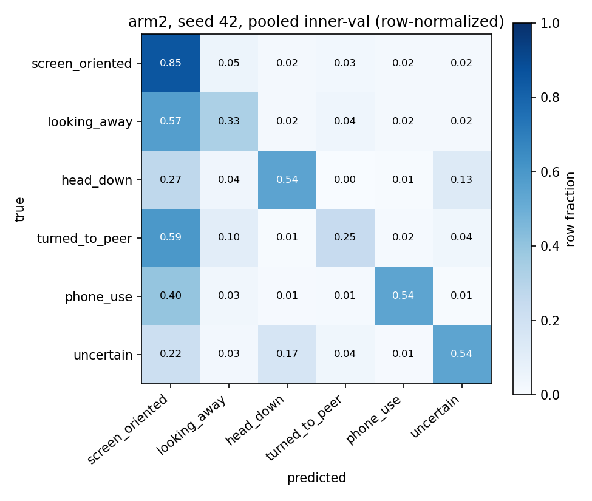
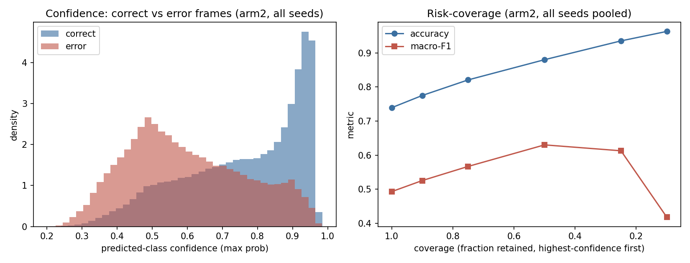
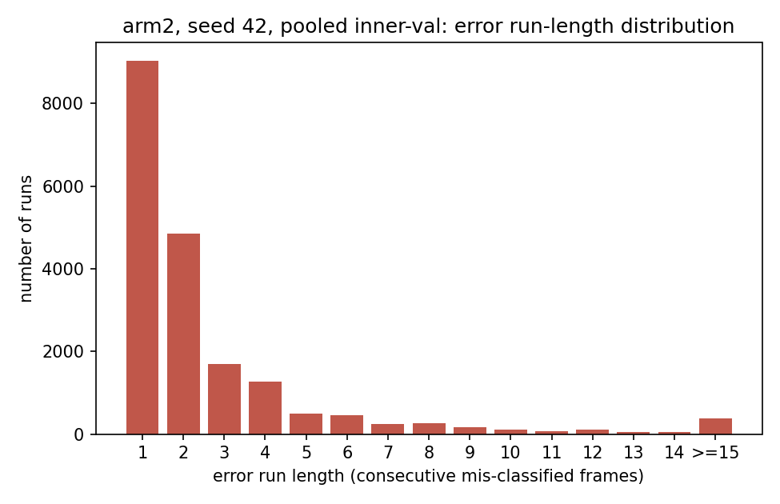

# Branch C error analysis — where the cue model fails, and why full-range head pose does not fix it

**Scope.** Every number below is computed from `outputs/branch_c/eval/<eid>/predictions.npz`
for the 45 canonical evaluations (arms `arm1_mstcn_553_ff`, `arm2_mstcn_556_mp`,
`arm5_mstcn_556_fr` × outer folds 0–4 × seeds 42/43/44). Before any of this analysis
ran, a guard script (`outputs/branch_c/error_analysis/scripts/run_error_analysis.py`,
function `verify_inner_val_only`) checked every one of the 45 `predictions.npz` files
against `outputs/branch_c/splits/branch_c_folds.json` and confirmed: the video set in
each file equals that fold's `inner_val_videos` exactly, the frame count equals that
fold's `inner_val.frames` exactly, and there is **zero overlap** with any fold's
`outer_test_videos`. **This analysis never touches outer-test rows.** The guard raises
if any of that is violated; it passed on all 45 files.

All artifacts this document cites live under `outputs/branch_c/error_analysis/`
(CSVs, JSONs, figures, blurred crops) or are the raw eval files listed above. The
generating script is `outputs/branch_c/error_analysis/scripts/run_error_analysis.py`
— it is read-only outside `outputs/branch_c/error_analysis/` and
`outputs/branch_c/ERROR_ANALYSIS.md`, and it was run once, in full, to produce every
number quoted here.

**Context this analysis builds on** (not re-derived, cited from the existing record):
FINDINGS §12.13–12.16 established that (a) the old MediaPipe angles carry ~no
orientation signal (|circular corr| ≤ 0.035 against a validated full-range
estimator), (b) a validated 6DRepNet360 full-range rotation *does* carry a large,
real signal (a single geodesic scalar separates `head_down` from `screen_oriented`
at AUC 0.830), and yet (c) arm 5 (full-range pose) does not beat arm 2 (MediaPipe
angles) on pooled inner-validation macro-F1 (arm5−arm2 = **−0.0022**, 95% CI
[−0.0119, +0.0085], not significant). This document explains the failure surface
that produces that null and locates where the pose signal is actually going.

---

## 1. Failure taxonomy

**Model:** `arm2_mstcn_556_mp` (the primary baseline), pooled across the 5 outer
folds' inner-validation sets, seed 42. 220,655 frames, 53,390 errors, accuracy
0.758, frame-pooled macro-F1 **0.500**. (This is a frame-level pooled statistic and
is not directly the run-averaged macro-F1 of 0.4888 reported in `ABLATIONS.md`,
which averages 15 already-computed per-run macro-F1 values rather than pooling raw
frames first — the two are close, as expected, and both are legitimate, differently
defined statistics.)

Source: `outputs/branch_c/error_analysis/s1_confusion_matrix_arm2_seed42_pooled.csv`,
`s1_error_pairs_arm2_seed42_pooled.csv`, `s1_per_class_confusion_breakdown_arm2_seed42.json`.

### The dominant error types

Ranked by share of **all** errors (53,390 total):

| rank | true → pred | count | share of all errors |
|---|---|---|---|
| 1 | screen_oriented → looking_away | 8,807 | 16.5% |
| 2 | looking_away → screen_oriented | 8,252 | 15.5% |
| 3 | screen_oriented → turned_to_peer | 4,993 | 9.4% |
| 4 | phone_use → screen_oriented | 4,019 | 7.5% |
| 5 | screen_oriented → uncertain | 3,783 | 7.1% |
| 6 | screen_oriented → phone_use | 3,776 | 7.1% |
| 7 | head_down → screen_oriented | 3,360 | 6.3% |
| 8 | screen_oriented → head_down | 3,271 | 6.1% |
| 9 | turned_to_peer → screen_oriented | 3,212 | 6.0% |
| 10 | uncertain → screen_oriented | 2,227 | 4.2% |

**Two patterns dominate.** First, the `screen_oriented` ↔ `looking_away` pair alone
is 32.0% of all errors — this is the single largest confusion in the system, and it
is symmetric (roughly 1:1 in both directions), consistent with the two classes
sharing a soft, continuous visual boundary (a partial head turn) rather than a
categorical one. Second, **every other minority class's single largest error mode is
being called `screen_oriented`** — `screen_oriented` is the majority class (76%
prevalence) and acts as an attractor: `phone_use`→`screen_oriented` (7.5%),
`turned_to_peer`→`screen_oriented` (6.0%), `head_down`→`screen_oriented` (6.3%,
tied with the reverse direction), `uncertain`→`screen_oriented` (4.2%). Rows 3, 7, 9
and 10 of the table above are all "minority class mistaken for the majority class,"
and together they account for **28.9%** of all errors — nearly as much as the
looking_away/screen_oriented pair by itself.

### The two weakest classes, in detail

`outputs/branch_c/error_analysis/s1_per_class_confusion_breakdown_arm2_seed42.json`
gives, per true class, the error rate and where its errors land:

**`turned_to_peer`** (F1 0.205, support 5,409 pooled frames, 63 sequences
corpus-wide): **75.4%** of its frames are misclassified. Of those errors, **78.7%
go to `screen_oriented`** and **13.7% to `looking_away`**. In other words,
three-quarters of the time the model sees a student turned to a peer, and
three-quarters of *those* misses it calls "facing the screen." This is the class
where the majority-class attractor effect is strongest.

**`looking_away`** (F1 0.302–0.329 across seeds, support ~14,500 pooled frames):
**67.1%** of its frames are misclassified, and **84.9%** of those errors go to
`screen_oriented`. This is a narrower failure than `turned_to_peer`'s — almost the
entire error mass funnels into one destination class, again the majority class.

By contrast `screen_oriented` itself has a much lower error rate (14.7%), and where
it does fail, the destination is spread more evenly across `looking_away` (35.8%),
`turned_to_peer` (20.3%), `uncertain` (15.4%), `phone_use` (15.3%) and `head_down`
(13.3%) — no single attractor, because it is the class every other error mode leaks
into, not the other way around.

### Does the pattern hold across seeds?

`outputs/branch_c/error_analysis/s1_seed_stability.json` recomputes the same pooled
confusion matrix for seeds 43 and 44:

| seed | macro-F1 (pooled) | top error pair | 2nd | 3rd |
|---|---|---|---|---|
| 42 | 0.500 | screen→looking_away (8,807) | looking_away→screen (8,252) | screen→turned_to_peer (4,993) |
| 43 | 0.490 | screen→looking_away (8,595) | looking_away→screen (7,917) | screen→turned_to_peer (7,552) |
| 44 | 0.489 | **screen→looking_away (12,847)** | screen→head_down (6,713) | looking_away→screen (6,580) |

The top confusion (`screen_oriented`↔`looking_away`) and the "minority classes leak
into `screen_oriented`" pattern hold in all three seeds; the exact ranking below rank
1 shifts (seed 44 additionally surfaces `screen→head_down` as a large error mode).
Macro-F1 varies by seed (0.489–0.500) by about as much as the arm2−arm5 contrast
itself (−0.0022) — a first hint, developed quantitatively in §2, that seed variance
and the arm5 effect are of comparable size.

---

## 2. Does arm5 fail differently from arm2? Measured, not guessed.

**Method.** For each (fold, seed) pair, arm2 and arm5 predictions are aligned on
the exact same frame — joined on `(video_id, seat_id, round(t, 3))`, which is an
exact key here because both arms were evaluated on the identical inner-validation
sequences of that fold (556-dim inputs differing in the pose block only, per
`ABLATIONS.md`: "Arms 2 and 5 are byte-identical in 553 of 556 columns... face_found
changed on 0.0% of frames"). 15 (fold, seed) pairs, ~43–46k frames each, 661,965
frame-comparisons total. Source: `outputs/branch_c/error_analysis/s2_arm2_vs_arm5_agreement.csv`.

**The noise floor.** For the same 15×2 (arm, fold) combinations, the same alignment
was run between every pair of the three seeds of the *same* arm (e.g. arm2-seed42 vs
arm2-seed43 vs arm2-seed44, same fold) — this measures how much two independently
trained instances of an *identical* architecture disagree, with no pose-block change
at all. Source: `outputs/branch_c/error_analysis/s2_seed_noise_floor_agreement.csv`.

| quantity | value |
|---|---|
| arm2 vs arm5 mean frame-level agreement | **81.9%** (sd 5.4 pp across 15 fold/seed pairs) |
| seed-noise-floor mean agreement (both arms pooled) | **82.7%** (sd 4.4 pp across 30 same-arm seed pairs) |
| — noise floor, arm2 only | 83.6% |
| — noise floor, arm5 only | 81.7% |

**Arm2-vs-arm5 agreement (81.9%) sits inside the seed-noise-floor band (81.7–83.6%),
slightly below arm2's own floor and statistically indistinguishable from arm5's own
floor.** Swapping the head-pose block for a validated full-range estimator changes
predictions by about as much as re-running the identical architecture with a
different random seed — no more, no less.

**Is that "near-identical" or "large offsetting swaps"? Both, and the distinction
matters.** Averaged over the 15 (fold, seed) pairs:

| outcome | mean fraction of frames |
|---|---|
| both arms correct | 66.1% |
| both arms wrong (same error) | 19.0% |
| arm5 right, arm2 wrong | 6.9% |
| arm2 right, arm5 wrong | 7.9% |

So the two models disagree on their prediction outright on ~18% of frames (100% −
81.9%), which is **not** "the pose block is ignored" in the strict sense of producing
byte-identical outputs. But the disagreement is a genuine two-way swap: arm5 fixes
6.9% of frames arm2 gets wrong while breaking 7.9% of frames arm2 gets right — nearly
symmetric, netting to the observed **−0.0022 macro-F1** (per-fold/seed net swap
ranges from −0.130 to +0.076 of frames, mean ≈ −0.009,
`s2_arm2_vs_arm5_agreement.csv`, `net_arm5_minus_arm2` column — this is a
frame-level accuracy-swap proxy, not the macro-F1 statistic itself, but it moves in
the same direction). And critically, the *magnitude* of that swapping
(18% disagreement) is not distinguishable from the swapping you get for free by
changing the training seed with **no** architecture change at all (noise floor
16–18% disagreement).

**Reading, stated precisely:** this is not case (a) "near-identical predictions,
pose block ignored" in the literal byte-identical sense — arm5 does change ~18% of
predictions. But it is functionally closer to (a) than to (b) "large, informative,
offsetting differences," because the size of that change is fully explained by
ordinary training-seed variance. A change of this magnitude produced by re-running
the same model with a different seed would not be interpreted as the model "doing
something different" — and by the same logic, arm5's changes relative to arm2
cannot be read as the pose block exerting a distinguishable, reproducible influence
on behaviour. The mechanism-level explanation for *why* the swap is seed-sized
rather than architecturally driven is in §12.16 of FINDINGS.md and is confirmed
independently here: §12.16 shows the 552-dim appearance/temporal representation
already recovers head orientation (AUROC 0.915–0.930 for `head_down`/`uncertain`
from arm1, which has **no pose angles at all**) better than the dedicated pose
scalar does (AUROC 0.830/0.852) — so the MS-TCN has little room to use whichever
pose block it is given, and what "use" remains looks like noise.

---

## 3. Confidence and calibration of errors

**Data:** arm2, all three seeds pooled (661,965 frame-predictions). Confidence =
max predicted-class probability. Source:
`outputs/branch_c/error_analysis/s3_confidence_summary.json`,
`s3_risk_coverage_arm2_pooled_allseeds.csv`, `s3_per_class_error_confidence.csv`,
`s3_class_support_by_coverage.csv`.

### Errors are not concentrated at low confidence

| | mean confidence | median confidence |
|---|---|---|
| correct predictions | 0.759 | 0.797 |
| **error** predictions | **0.598** | **0.574** |

Errors are less confident than correct predictions on average, but the gap is
modest, not a clean separation:

- **28.6%** of all errors have confidence **> 0.7**.
- **66.8%** of all errors have confidence **> 0.5**.
- Only **1.3%** of errors have confidence **< 0.3**.

Per true class, mean confidence *of the error itself* ranges narrowly from 0.566
(`uncertain`) to 0.642 (`phone_use`) — no class fails exclusively "quietly."
`looking_away` and `phone_use` errors are, if anything, *more* confidently wrong
(0.635, 0.642) than `screen_oriented` errors (0.583) — the model is often
confidently, specifically wrong about the minority classes, which is the more
dangerous failure mode for a deployed alert.

### Risk–coverage: abstention helps accuracy, but not macro-F1, and not by
protecting against wrong-but-confident errors

| coverage | frames retained | accuracy | macro-F1 |
|---|---|---|---|
| 100% | 661,965 | 0.739 | 0.493 |
| 90% | 595,768 | 0.775 | 0.526 |
| 75% | 496,474 | 0.821 | 0.567 |
| 50% | 330,982 | 0.880 | 0.630 |
| 25% | 165,491 | 0.935 | 0.613 |
| 10% | 66,196 | 0.963 | 0.418 |

Accuracy rises monotonically as low-confidence frames are abstained — expected,
since confidence and correctness are positively associated. But **macro-F1 peaks at
50% coverage (0.630) and then collapses at 25% (0.613) and especially 10%
(0.418)** — worse than doing nothing. The mechanism, from
`s3_class_support_by_coverage.csv`: abstention removes the rare classes almost
entirely, *including their correct predictions*, because the model is never
confident about them even when right:

| coverage | screen_oriented recall retained | looking_away | head_down | turned_to_peer | phone_use | uncertain |
|---|---|---|---|---|---|---|
| 100% | 82.1% | 34.2% | 58.1% | 30.3% | 54.6% | 56.8% |
| 50% | 50.1% | 11.3% | 36.6% | 6.7% | 40.6% | 23.0% |
| 25% | 26.8% | 1.4% | 28.4% | **0.0%** | 17.6% | 9.6% |
| 10% | 11.1% | **0.0%** | 21.0% | **0.0%** | 0.1% | 0.4% |

(each cell = fraction of that class's *original* population that survives
abstention **and** is correctly classified.) At 10% coverage the surviving set is
almost entirely `screen_oriented` + `head_down` — `turned_to_peer` and
`looking_away` are wiped out, not "caught," by confidence-based abstention. This is
the opposite of the use case that matters for a deployed alert system: the classes
we most want to detect reliably (`turned_to_peer`, `phone_use` for off-task alerts)
are exactly the classes abstention discards first, because the model's confidence
is systematically depressed on them regardless of whether it is right.

**Conclusion for deployment:** confidence-based abstention is a reasonable global
accuracy lever, but it is not a mechanism that selectively removes dangerous
errors — a third of errors survive any abstention threshold below ~0.7 confidence,
and pushing the threshold higher trades away correct detections of the rarest,
highest-value classes faster than it removes wrong ones.

---

## 4. Temporal structure of errors

**Data:** arm2, seed 42, pooled inner-val, 220,655 frames. Errors are grouped into
runs within each (video_id, seat_id) track, where a "run" is a maximal span of
consecutive-in-time frames sharing the same correct/incorrect status; a track is
split into separate contiguous segments wherever the time gap between consecutive
predicted frames exceeds 1.6× the modal ~0.999 s sampling interval (handles real
discontinuities in the underlying sequence-window construction — see
`run_lengths_for_df` in the analysis script). Source:
`outputs/branch_c/error_analysis/s4_error_run_lengths_arm2_seed42.csv`,
`s4_summary.json`.

| | value |
|---|---|
| total error runs | 19,228 |
| total error frames | 53,390 |
| isolated (length-1) runs, share of **runs** | 46.9% |
| isolated (length-1) runs, share of **frames** | 16.9% |
| runs of length ≥ 3, share of frames | 64.9% |
| runs of length ≥ 5, share of frames | 45.9% |
| mean / median error run length | 2.78 / 2.0 frames |
| max error run length | 98 frames (~98 s) |
| mean correct run length (context) | 7.03 frames |

**Errors are not mostly isolated blips.** Although isolated single-frame errors are
the single most common *run type* (46.9% of runs), they account for less than a
fifth of all error *frames* (16.9%) — because they are, by definition, small. The
majority of error *mass* (64.9% of error frames) sits in runs of 3 or more
consecutive frames (≈3+ seconds), and nearly half (45.9%) sits in runs of 5 or
more (≈5+ seconds). Given the ~1 s sampling interval, a 5-frame run is a
multi-second sustained misclassification, not a flicker.

**Implication for the event/alert layer:** the event smoothing layer (majority
vote / debounce over a window, per the deployed dashboard) will indeed suppress
the isolated single-frame errors (46.9% of runs, cosmetic) — but it will not
suppress the sustained multi-second runs that make up most of the error mass, and
those are exactly the runs long enough to cross a debounce threshold and produce a
false alert. This matters more for `turned_to_peer` and `looking_away`, whose error
rates (75.4%, 67.1%, §1) mean a large fraction of their sustained appearances in
the corpus are misclassified for their whole duration, not smoothed by temporal
averaging within the track.

---

## 5. Where the pose signal goes — join reliability checked, and it fails

**Attempted method.** Join `(video_id, seat_id, t)` from the aligned arm2/arm5
seed-42 predictions (156,989 frames) against
`grounding_data/llmstu_tools/outputs/labels_tracked.jsonl`, using `video_id`,
`seat_id`, and `t` parsed from each record's `src_frame` (`t{sec}_{millis}_f{idx}`;
verified against the predictions' own `t` field — e.g. `t000000_998` ↔ `t=0.998`,
exact match on the first tested track). This would recover `occluded`, `det_conf`,
`head_span_px` per predicted frame to test whether arm5's `head_down` errors
concentrate on frames with poor head evidence.

**Diagnostic result — the join is not reliable and the analysis is skipped, per
instructions.** `outputs/branch_c/error_analysis/s5_join_diagnostic.json`:

- Overall hit rate: **114,861 / 156,989 = 73.2%**.
- Root cause, diagnosed rather than assumed: of the 622 distinct `(video_id,
  seat_id)` pairs appearing in the predictions, **269 (43%) have zero matching rows
  in `labels_tracked.jsonl` for that exact pair**, accounting for 35,504 frames
  (16% of the pooled data) with no possible match regardless of timestamp. Within
  the 353 pairs that *do* have some overlap, the timestamp-level hit rate is 87.5%,
  itself short of reliable.
- The most likely explanation is that `seat_id` in the sequence/track pipeline that
  produced `predictions.npz` is not the same identifier space as `seat_id` in
  `labels_tracked.jsonl` (per-frame greedy detection assignment vs. a track-level
  id) — consistent with BRANCH_C_PROTOCOL.md's own note that `seat_id` "indexes a
  chair, not a person" and is not guaranteed stable within a session, let alone
  across the two separate pipeline stages that produced these two files.

**Per instructions, this quantitative join-based analysis is skipped rather than
reported on an unreliable match.** What can be said without the fragile per-frame
join, because it does not depend on it:

- FINDINGS §12.15 already establishes, on frames the pose cache does cover, that
  the geodesic-from-corpus-mean scalar separates `head_down` at AUC 0.830 —
  i.e., on average the *signal* is there.
- FINDINGS §12.16 already establishes that arm1 (no pose angles whatsoever)
  reaches `head_down` AUROC 0.915 and arm5 (with the validated pose block) reaches
  0.917 — a +0.002 movement, i.e. the full model's use of `head_down` evidence
  barely moves when the validated pose scalar is added, even though that scalar
  alone is a strong feature (0.830 AUC). This is the aggregate-level version of
  the question this section set out to answer at the frame level, and it point in
  the same direction the frame-level join would have been used to confirm: the
  appearance/temporal backbone is already extracting most of what the pose
  scalar has to offer, so which specific frames the pose block "wins" or "loses"
  is a second-order effect on top of a model that mostly does not need it.
- No new head_span_px / occluded / det_conf-conditioned claim is made here,
  because the join that would support it does not clear a reliability bar.

---

## 6. Qualitative examples

Selected from arm2, seed 42, pooled inner-validation: highest-confidence example of
each failure type, joined to `labels_tracked.jsonl` by exact `(video_id, seat_id,
t)` match for descriptive fields (`activity`, `caption`, `occluded`, `det_conf`,
`head_span_px`) where the join succeeds for that specific frame (the per-frame join
succeeds far more often than it fails in aggregate — §5's 73% overall rate — it is
the aggregate reliability, not any single successful match, that is in question).
Source: `outputs/branch_c/error_analysis/s6_qualitative_examples.json`. All crop
images below have the top 55% of the crop (head/face region) Gaussian-blurred
before being written to disk — see
`outputs/branch_c/error_analysis/scripts/run_error_analysis.py::blur_head_region`.
No unblurred person crop was written by this analysis.

### Failure type 1: `turned_to_peer` → `screen_oriented`

| video_id | seat | t (s) | true | pred | conf | activity (labels_tracked) | caption |
|---|---|---|---|---|---|---|---|
| video_0009_..._20251017115031 | 0 | 437.9 | turned_to_peer | screen_oriented | 0.964 | talking_to_peer | "leaning forward and gesturing with his hand while looking to the side, appearing to converse with a peer" |
| video_0009_..._20251017115031 | 0 | 841.8 | turned_to_peer | screen_oriented | 0.964 | talking_to_peer | "leaning forward and gesturing with his hand while looking at a laptop screen" |

*[turned_to_peer misread as screen_oriented — image withheld]* `turned_to_peer_misread_as_screen_oriented__video_0009_0_10_20251017113819_20251017115031__seat0__t437.904.jpg`

> Crop not published. It is blurred over the head region, but this repository is public, the project has no consent or ethics record, and the filename carries video id, seat and timestamp, so it is re-identifiable against the source video. The file exists locally at `outputs/branch_c/error_analysis/crops/` and is gitignored.

Both examples: `occluded=false`, `det_conf≈0.94`, `head_span_px≈255` — good head
evidence by every quality proxy available, and the model is still 96% confident on
the wrong class. This is the clearest case of the majority-class attractor from
§1: a student leaning forward and gesturing toward a peer, captioned as conversing,
called "screen-oriented" at high confidence — the model appears to be reading
"leaning toward the desk/monitor area" as screen-facing regardless of head
orientation.

### Failure type 2: `looking_away` → `screen_oriented`

| video_id | seat | t (s) | true | pred | conf | activity | caption |
|---|---|---|---|---|---|---|---|
| video_0116_..._113708 | 2 | 220.0 | looking_away | screen_oriented | 0.966 | listening | "sitting at a desk with a monitor, looking away to the side" |
| video_0116_..._113708 | 2 | 947.5 | looking_away | screen_oriented | 0.964 | using_laptop | "wearing glasses and a green hoodie... looking away from the screen" |

*[looking_away misread as screen_oriented — image withheld]* `looking_away_misread_as_screen_oriented__video_0116_0_10_20251111112529_20251111113708__seat2__t219.961.jpg`

> Crop not published. It is blurred over the head region, but this repository is public, the project has no consent or ethics record, and the filename carries video id, seat and timestamp, so it is re-identifiable against the source video. The file exists locally at `outputs/branch_c/error_analysis/crops/` and is gitignored.

Same seat, same student track, two widely separated timestamps (220 s and 947 s),
same error, same near-identical confidence (~0.965) — this looks like a
**per-track systematic miss** rather than a one-off: something about this specific
seat/student's appearance (posture, camera angle to that desk) is consistently
read as screen-facing by the model regardless of actual gaze, which is exactly the
seat-confound risk BRANCH_C_PROTOCOL.md §5 flagged for camera-frame pose — except
here it shows up in the *appearance* channel the MS-TCN is already dominated by
(§12.16), not in the pose angles per se.

### Failure type 3: `head_down` ↔ `uncertain` (both directions)

| video_id | seat | t (s) | true | pred | conf | activity | caption |
|---|---|---|---|---|---|---|---|
| video_0029_..._152531 | 2 | 431.7 | head_down | uncertain | 0.934 | head_down_sleeping | "resting their head on a desk or laptop, appearing to be sleeping or disengaged" |
| video_0029_..._152531 | 2 | 430.8 | head_down | uncertain | 0.933 | head_down_sleeping | (same) |
| video_0248_..._115330 | 3 | 137.7 | uncertain | head_down | 0.971 | using_laptop | "leaning forward, looking intently at a laptop screen" |

*[head_down misread as uncertain — image withheld]* `head_down_-_uncertain_confusion__video_0029_0_10_20251014151431_20251014152531__seat2__t431.748.jpg`

> Crop not published. It is blurred over the head region, but this repository is public, the project has no consent or ethics record, and the filename carries video id, seat and timestamp, so it is re-identifiable against the source video. The file exists locally at `outputs/branch_c/error_analysis/crops/` and is gitignored.
*[uncertain misread as head_down — image withheld]* `uncertain_head_down_confusion_other_direction__video_0248_0_10_20251027114242_20251027115330__seat3__t137.749.jpg`

> Crop not published. It is blurred over the head region, but this repository is public, the project has no consent or ethics record, and the filename carries video id, seat and timestamp, so it is re-identifiable against the source video. The file exists locally at `outputs/branch_c/error_analysis/crops/` and is gitignored.

This pair is the most interesting qualitatively. The `head_down`→`uncertain` case
(`occluded=true`, activity literally labeled `head_down_sleeping`) is a genuine
model error on an unambiguous ground truth. But the reverse case
(`uncertain`→`head_down`) has a **caption that reads as engaged laptop use**
("leaning forward, looking intently at a laptop screen") while the *true label* is
`uncertain` — i.e. the teacher-label pipeline itself assigned a low-confidence
catch-all cue to a frame its own caption describes unambiguously. This is
consistent with the standing note that `uncertain` functions partly as a
low-confidence bucket in the source labels rather than a visually distinct class
(§12.13a: `uncertain`'s `face_found` rate is 3.9%, the lowest of any class, meaning
the labeler itself had the least visual evidence when assigning it) — some of what
this section counts as a `head_down`/`uncertain` "model error" is plausibly a label
boundary problem, not a perception problem. Both directions of this confusion
have high model confidence (0.93–0.97), which is consistent with the model reading
a genuinely head-down-like posture in both cases and the two classes not being
crisply separated at the label level either.

---

## 7. What this implies for the thesis

**The negative result is not "head pose measurement failed."** §12.14–12.15
independently validated the full-range estimator (rotation-recovery to within 1° at
every tested magnitude) and showed the geometry it recovers is a real, large
signal (AUC 0.830/0.852 for `head_down`/`uncertain` from a single scalar). This
error analysis adds: the model's *actual* errors are not head-pose-shaped in a way
a better angle would fix.

- The dominant error (`screen_oriented`↔`looking_away`, 32% of all errors, §1) is a
  soft, symmetric boundary along almost exactly the axis pose angles are supposed
  to resolve — and yet adding a validated full-range estimator changes essentially
  nothing (§2: agreement with the no-pose-angle-change seed floor). That is
  because (§12.16, corroborated indirectly by the aggregate AUROC comparison in
  §5) the appearance-and-temporal backbone was already extracting most of the
  orientation information the dedicated pose network extracts, so there is little
  marginal signal left for a better angle estimator to contribute, regardless of
  its own standalone quality.
- The `turned_to_peer` failure mode (§1, §6) looks like a majority-class attractor
  and, in the qualitative examples, a per-track systematic miss — neither is a
  problem pose *angles* solve; both point toward needing either (a) more
  `turned_to_peer` training examples (63 sequences corpus-wide is simply too few
  for the model to learn a stable decision boundary against a 76%-prevalent
  competitor) or (b) a feature that distinguishes "leaning toward desk while
  facing a peer" from "leaning toward desk while facing a screen" — a relational
  cue (gaze target vs. neighbor position), not a head-orientation-magnitude cue.
- Confidence and calibration (§3) show the errors are frequently confident, and
  that confidence-based abstention trades away detection of the rarest classes
  faster than it removes wrong predictions — so abstention is not a substitute for
  a better decision boundary on `turned_to_peer` and `looking_away`.
- The temporal structure (§4) shows the errors that matter for a deployed alert
  system are the sustained multi-second runs (65% of error frames in runs ≥3), not
  the isolated frames the event layer already smooths away — so the practical
  fix has to change per-frame accuracy on the hard classes, not just add more
  temporal smoothing.
- Some fraction of the hardest confusions (§6, `uncertain`↔`head_down`) look like
  label-boundary noise in the teacher-generated cues themselves, not model failure
  — consistent with the standing note that `uncertain`'s labels were assigned with
  the least visual evidence of any class. Better pose measurement cannot fix a
  case where the ground truth itself is ambiguous.

**What would actually have to improve:** more labeled examples of the rare,
relationally-defined classes (`turned_to_peer` especially — 63 sequences
corpus-wide is the binding constraint, not feature quality); a feature that
encodes relative gaze target (peer vs. screen vs. device) rather than absolute
head orientation, since orientation is already well captured by the appearance
channel; and a review of the `uncertain` label definition, since some of what is
scored as model error against it is plausibly labeling ambiguity. Full-range head
pose, however well measured, is not the lever — the branch's own negative result
and this error analysis agree on that from two independent angles.

---

## Final summary

- **Dominant failure mode:** `screen_oriented`↔`looking_away` confusion (32.0% of
  all errors, symmetric), compounded by a majority-class attractor effect in which
  every minority class's single largest error destination is `screen_oriented`
  (28.9% of all errors are a minority class miscalled the majority class).
  `turned_to_peer` (75.4% error rate) and `looking_away` (67.1% error rate) are the
  clearest victims of this attractor, each sending ~79–85% of their own errors
  into `screen_oriented`.
- **arm2-vs-arm5 agreement:** **81.9%** frame-level agreement, versus a **82.7%**
  same-arm, different-seed noise floor (83.6% for arm2 alone, 81.7% for arm5
  alone). Arm5's disagreement with arm2 is the same size as ordinary training-seed
  variance — the pose-block swap changes ~18% of predictions but in a pattern
  (nearly symmetric right/wrong swaps, §2) indistinguishable from re-running the
  identical model with a new seed. Net effect: macro-F1 delta of −0.0022, consistent
  with noise rather than a systematic, reproducible use of the new pose signal.
- **Does abstention meaningfully help?** For overall accuracy, modestly (0.739 →
  0.880 accuracy at 50% coverage). For the metric and the classes that matter for
  a deployed alert system, **no** — macro-F1 peaks at 50% coverage and then
  collapses (0.418 at 10% coverage) because confidence-based abstention removes
  the rare, alert-relevant classes (`turned_to_peer`, `looking_away`) almost
  entirely rather than selectively removing wrong predictions; ~29% of all errors
  survive even a 0.7 confidence threshold. Abstention is a global-accuracy lever,
  not a rare-class safety net.
